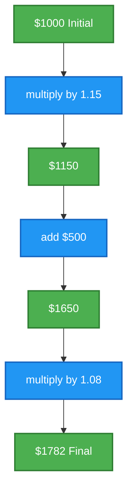
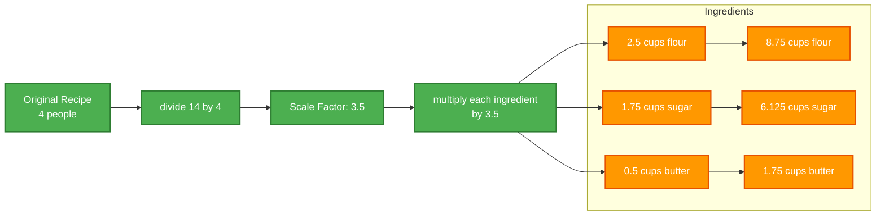
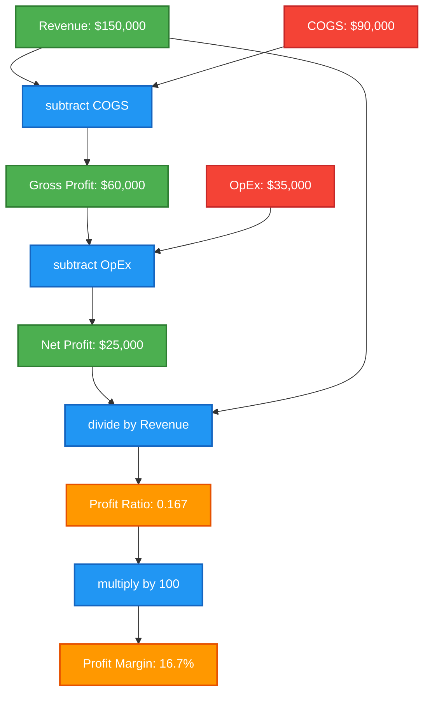
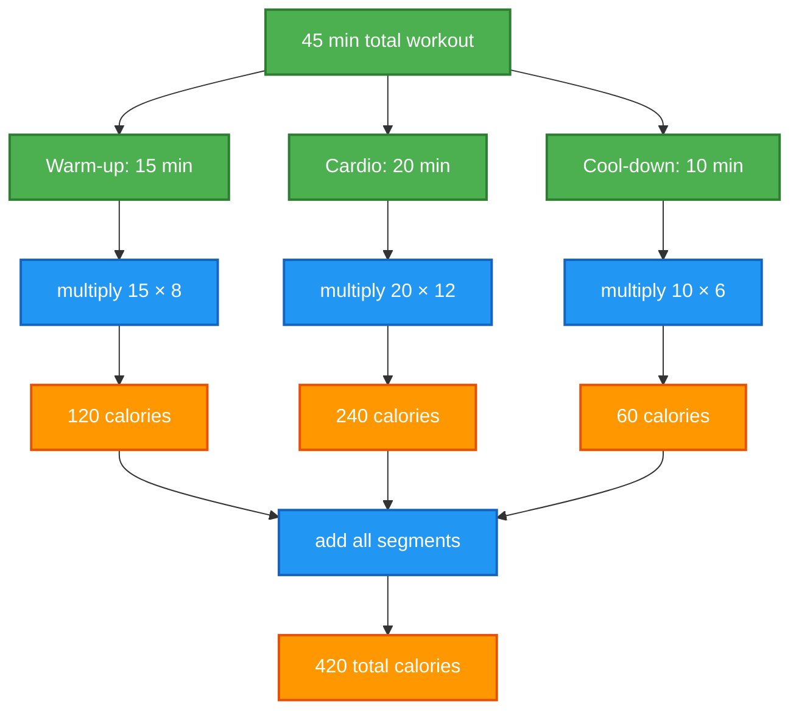
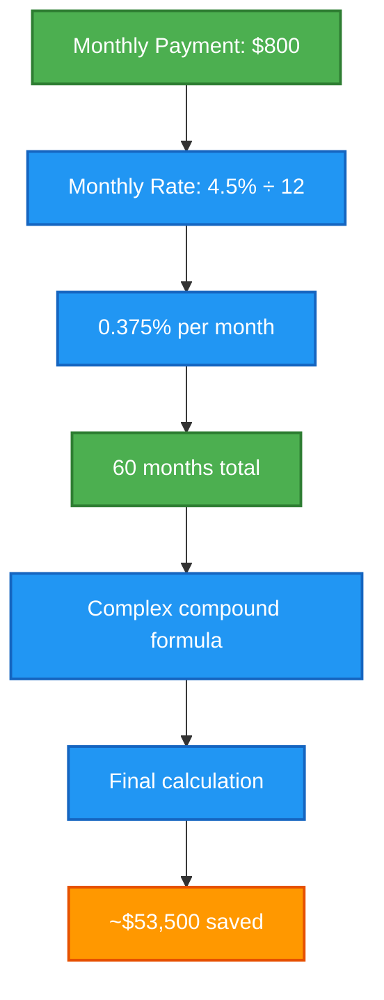
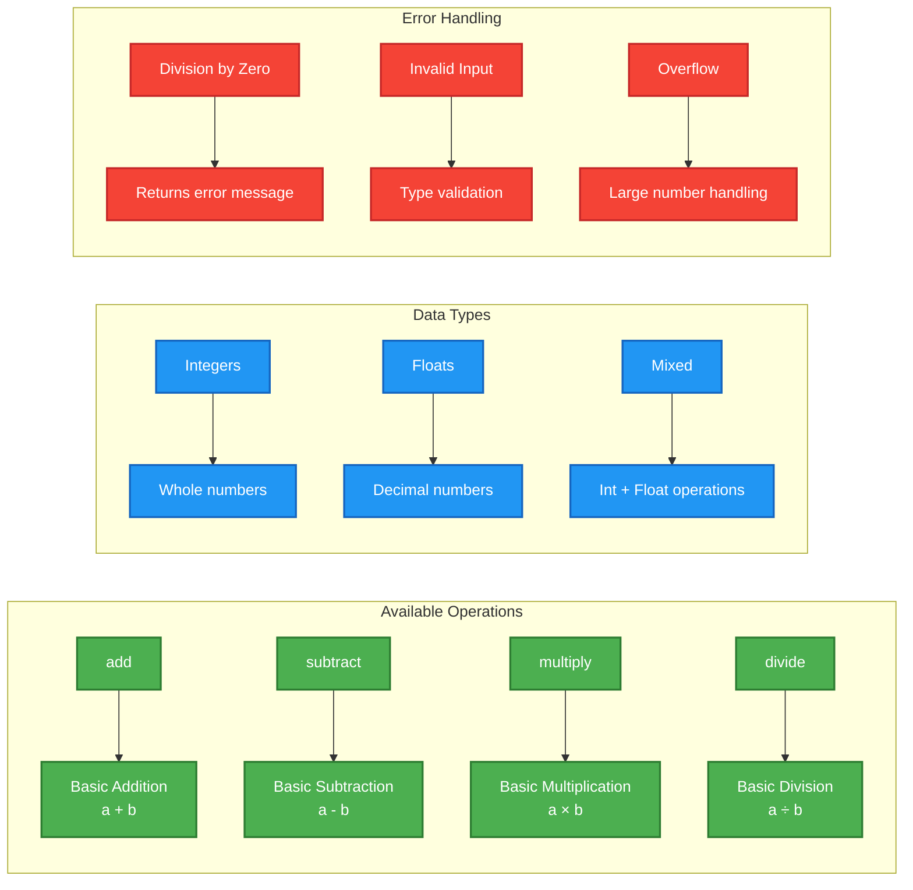

# 🧮 Calculator MCP Server - Practical Examples

## Overview
This document provides real-world prompt examples for using the Calculator MCP Server, demonstrating various mathematical computation scenarios.

---

## 🔢 Basic Math Operations

### Example 1: Simple Addition
```
Calculate the total cost of my shopping list:
- Groceries: $45.67
- Gas: $32.50
- Coffee: $4.25

Please add these amounts together.
```

**Expected MCP Tool Call:**
```json
{
  "method": "tools/call",
  "params": {
    "name": "add",
    "arguments": {
      "a": 45.67,
      "b": 32.50
    }
  }
}
```

**Then:**
```json
{
  "method": "tools/call",
  "params": {
    "name": "add",
    "arguments": {
      "a": 78.17,
      "b": 4.25
    }
  }
}
```

**Result:** Total cost: $82.42

---

### Example 2: Multi-step Calculation
```
I'm planning a dinner party for 8 people. Each person will eat approximately 0.75 pounds of food.
If food costs $12 per pound, what's my total food budget?

First multiply 8 × 0.75, then multiply that result by 12.
```

**MCP Tool Sequence:**
1. `multiply(8, 0.75)` → 6 pounds needed
2. `multiply(6, 12)` → $72 total budget

---

## 📊 Financial Calculations

### Example 3: Investment Returns
```
I invested $1000 in stocks and it grew by 15%.
Then I added another $500 and the total grew by 8%.
What's my final investment value?

Step 1: Calculate 15% gain on $1000
Step 2: Add $500 to that result  
Step 3: Calculate 8% gain on the new total
```

**Calculation Flow:**


**MCP Tool Calls:**
1. `multiply(1000, 1.15)` → $1150
2. `add(1150, 500)` → $1650  
3. `multiply(1650, 1.08)` → $1782

---

## 🏠 Home Projects

### Example 4: Room Painting
```
I need to paint a rectangular room that's 12 feet by 15 feet.
The paint coverage is 400 square feet per gallon, and paint costs $35 per gallon.
How much will the paint cost?

Calculate: (12 × 15) ÷ 400 = gallons needed, then multiply by $35
```

**MCP Tool Sequence:**
1. `multiply(12, 15)` → 180 sq ft
2. `divide(180, 400)` → 0.45 gallons
3. `multiply(0.45, 35)` → $15.75

---

### Example 5: Recipe Scaling
```
I have a recipe for 4 people that calls for:
- 2.5 cups flour
- 1.75 cups sugar  
- 0.5 cups butter

I need to make it for 14 people. What are the new ingredient amounts?

Calculate the scaling factor: 14 ÷ 4, then multiply each ingredient by that factor.
```

**Scaling Calculation:**


**MCP Tool Calls:**
1. `divide(14, 4)` → 3.5 (scale factor)
2. `multiply(2.5, 3.5)` → 8.75 cups flour
3. `multiply(1.75, 3.5)` → 6.125 cups sugar
4. `multiply(0.5, 3.5)` → 1.75 cups butter

---

## 💰 Business Calculations

### Example 6: Profit Margin Analysis
```
My business has:
- Revenue: $150,000
- Cost of goods: $90,000  
- Operating expenses: $35,000

Calculate my profit margin percentage:
(Revenue - COGS - OpEx) ÷ Revenue × 100
```

**Business Metrics Flow:**


**MCP Tool Sequence:**
1. `subtract(150000, 90000)` → $60,000
2. `subtract(60000, 35000)` → $25,000
3. `divide(25000, 150000)` → 0.167
4. `multiply(0.167, 100)` → 16.7%

---

## 🚗 Travel Planning

### Example 7: Road Trip Budget
```
Planning a road trip:
- Distance: 1,200 miles
- Car gets 28 MPG
- Gas costs $3.45 per gallon
- Will make the round trip

Calculate total gas cost for the round trip.
```

**Trip Cost Calculation:**


**MCP Tool Calls:**
1. `multiply(1200, 2)` → 2,400 miles
2. `divide(2400, 28)` → 85.71 gallons
3. `multiply(85.71, 3.45)` → $295.65

---

## 🏋️ Fitness Tracking

### Example 8: Calorie Burn Calculation
```
I exercised for 45 minutes and burned calories at these rates:
- First 15 minutes: 8 calories per minute (warm-up)
- Next 20 minutes: 12 calories per minute (cardio)  
- Last 10 minutes: 6 calories per minute (cool-down)

Calculate my total calories burned.
```

**Workout Breakdown:**


**MCP Tool Sequence:**
1. `multiply(15, 8)` → 120 calories
2. `multiply(20, 12)` → 240 calories  
3. `multiply(10, 6)` → 60 calories
4. `add(120, 240)` → 360 calories
5. `add(360, 60)` → 420 total calories

---

## 🎯 Advanced Use Cases

### Example 9: Compound Interest
```
I want to save $50,000 for a house down payment.
I can save $800 per month at 4.5% annual interest rate.
How much will I have after 5 years?

This requires multiple calculations for compound growth.
```

**Monthly Compound Interest:**


**Simplified MCP Calculation:**
1. `divide(4.5, 12)` → 0.375% monthly rate
2. `divide(0.375, 100)` → 0.00375 decimal rate
3. Multiple monthly calculations...

---

## 🛠️ Calculator Server Features



---

## 🚀 Quick Testing Commands

```bash
# Test the calculator server
cd /Users/elsayed/side-projects/sessions/stdio_mcp_server

# Start the calculator server
uv run python calculator_mcp_server.py

# In another terminal, test with MCP client
cd ../mcp_client
uv run python client.py ../stdio_mcp_server/calculator_mcp_server.py

# Example client commands:
# add 25.5 30.2
# multiply 12 15  
# divide 100 7
# subtract 50 23
```

---

*Calculator MCP Server - Your reliable mathematical computation companion! 🧮*
