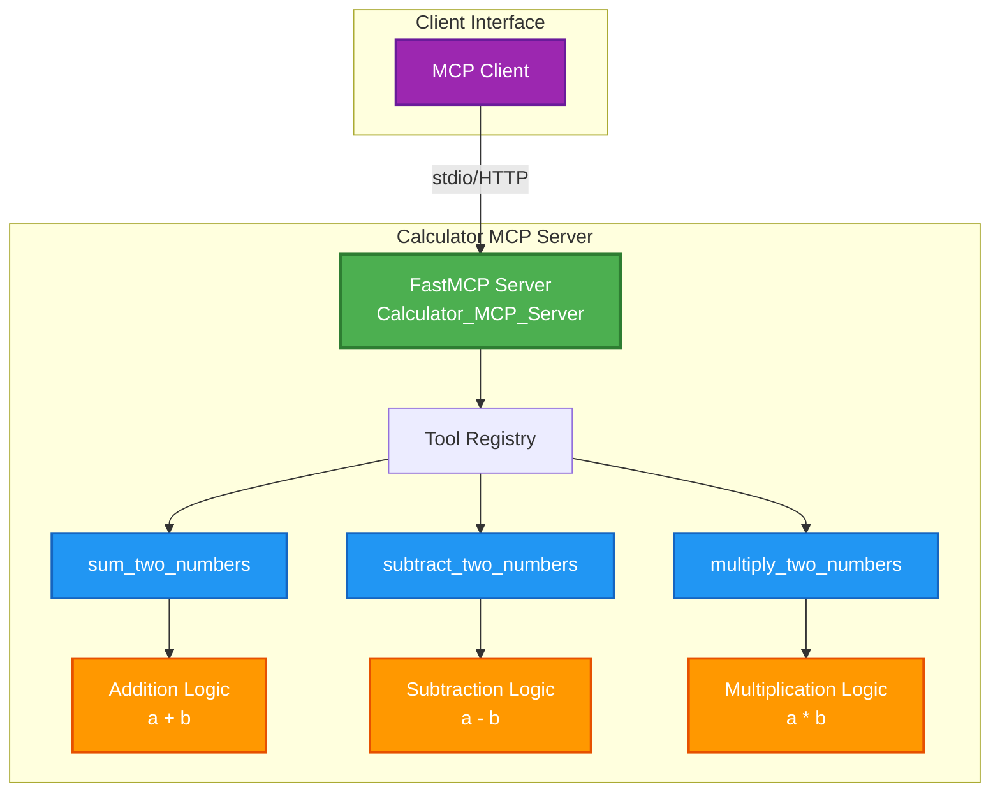
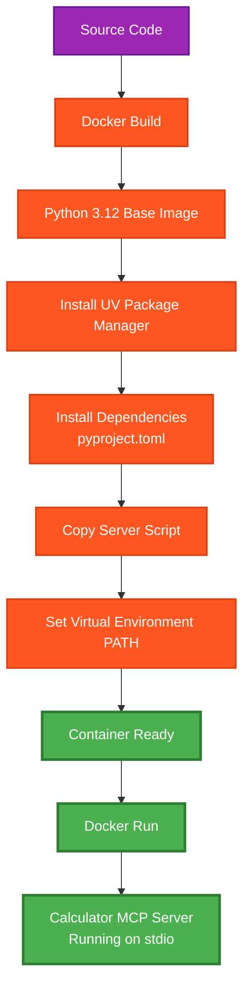
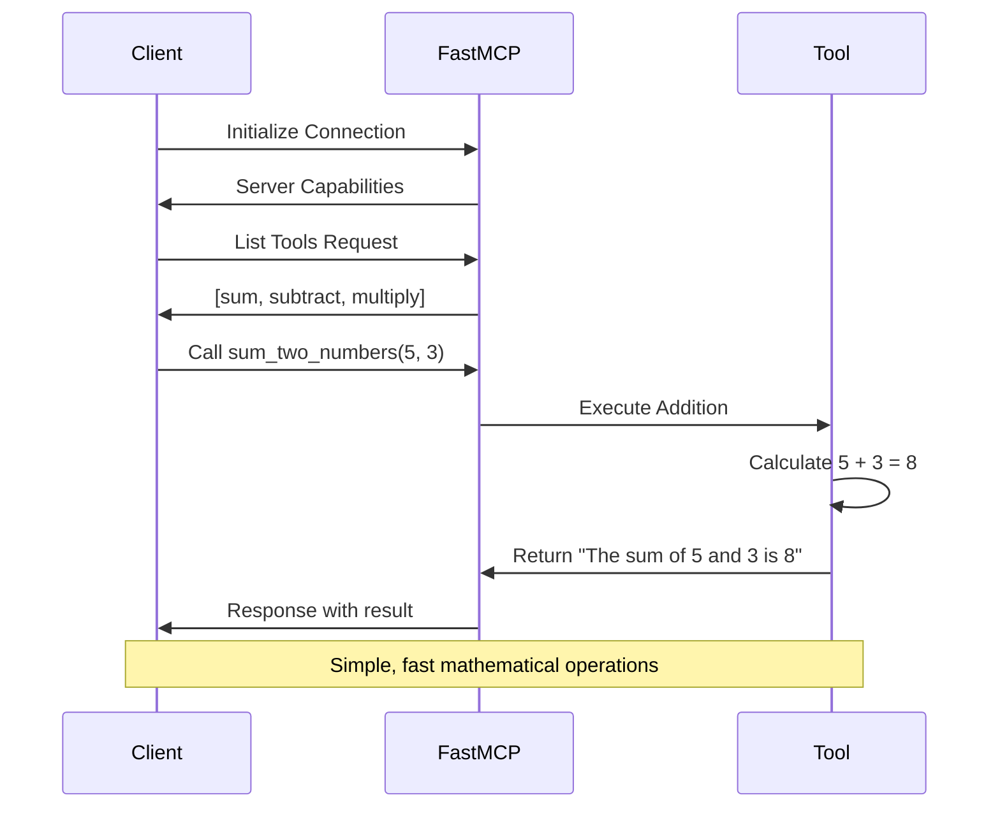

# 🧮 Calculator MCP Server Architecture

## Overview
The Calculator MCP Server provides basic mathematical operations through a clean MCP interface.

---

## 🏗️ Server Architecture



---

## 🔧 Tool Details

```mermaid
graph LR
    subgraph "Available Tools"
        direction TB
        
        subgraph "Sum Tool"
            A1[sum_two_numbers] --> A2[Input: a, b<br/>Type: int]
            A2 --> A3[Output: String<br/>Result + message]
        end
        
        subgraph "Subtract Tool"
            B1[subtract_two_numbers] --> B2[Input: a, b<br/>Type: int]
            B2 --> B3[Output: String<br/>Result + message]
        end
        
        subgraph "Multiply Tool"
            C1[multiply_two_numbers] --> C2[Input: a, b<br/>Type: int]
            C2 --> C3[Output: String<br/>Result + message]
        end
    end
    
    classDef toolName fill:#2196F3,stroke:#1565C0,stroke-width:3px,color:#fff
    classDef input fill:#4CAF50,stroke:#2E7D32,stroke-width:2px,color:#fff
    classDef output fill:#FF9800,stroke:#E65100,stroke-width:2px,color:#fff
    
    class A1,B1,C1 toolName
    class A2,B2,C2 input
    class A3,B3,C3 output
```



---

## 🐳 Docker Deployment Flow



---

## 🔄 Request/Response Flow



---

## 📋 Quick Commands

### Build & Run
```bash
# Build Docker image
docker build -f calculatorMcp.Dockerfile -t calculator-mcp .

# Run container
docker run -i --rm calculator-mcp

# Direct Python execution
uv run python calculator_mcp_server.py
```

### Tool Usage Examples
```json
{
  "name": "sum_two_numbers",
  "arguments": {"a": 10, "b": 5}
}
// Returns: "The sum of 10 and 5 is 15 (Calculated by MCP server)."

{
  "name": "multiply_two_numbers", 
  "arguments": {"a": 7, "b": 3}
}
// Returns: "The product of 7 and 3 is 21 (Calculated by MCP server)."
```

---

## 🎯 Key Features

- ✅ **Simple Math Operations**: Addition, subtraction, multiplication
- 🚀 **FastMCP Framework**: Quick setup and deployment
- 🐳 **Docker Ready**: Containerized for easy deployment
- 📡 **stdio Transport**: Standard input/output communication
- 🔒 **Type Safety**: Integer input validation
- 💬 **Descriptive Responses**: Clear result messages

---

*Calculator MCP Server - Making math simple through MCP! 🧮*
