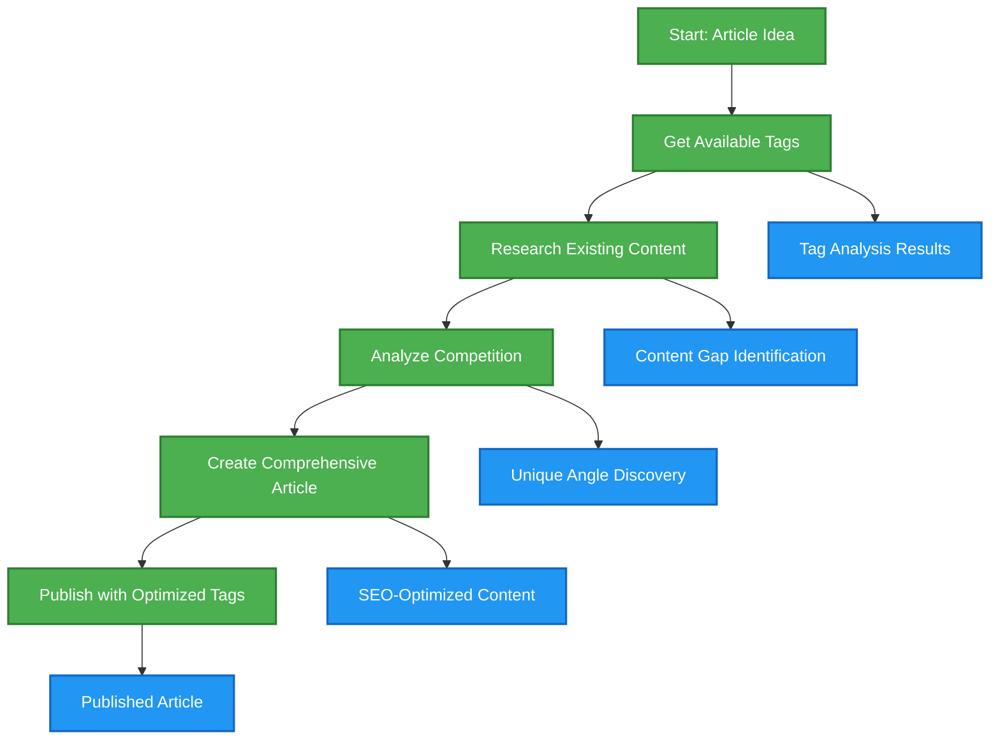
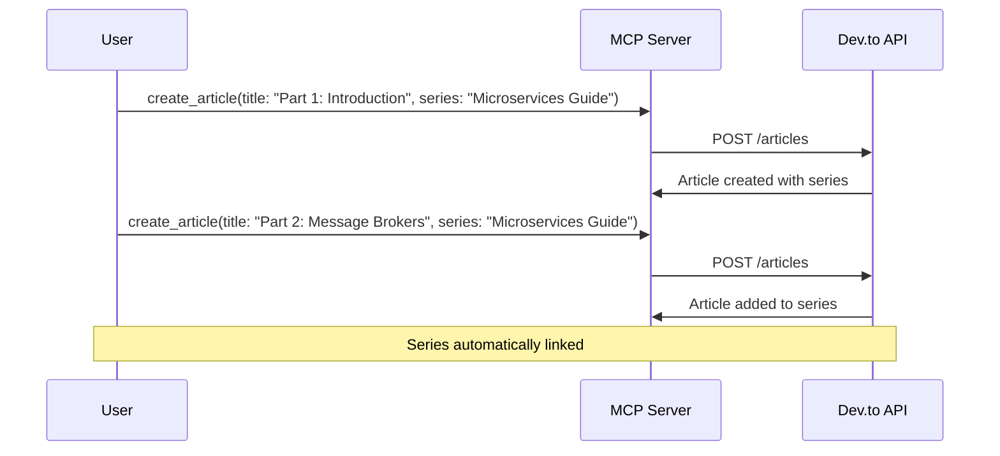
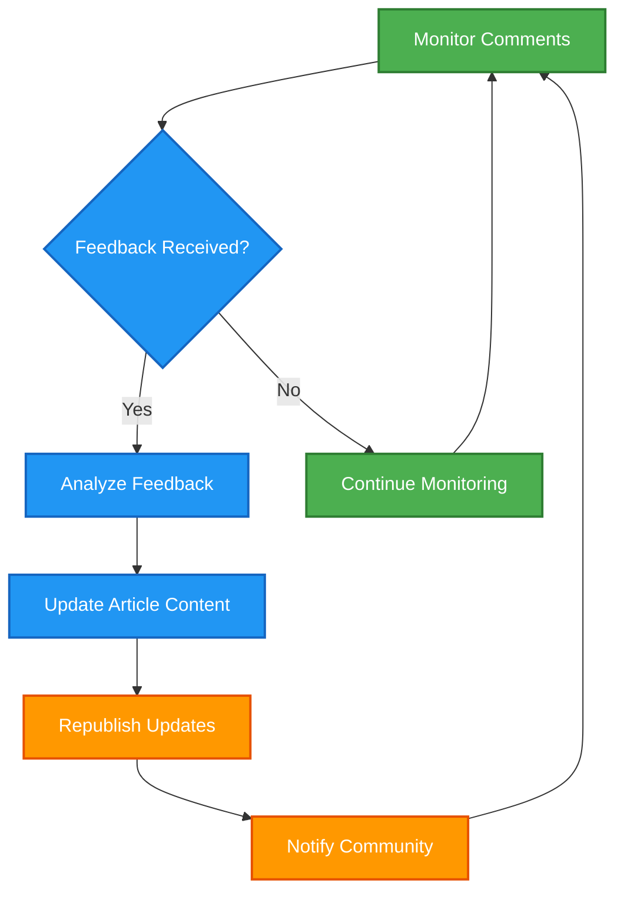
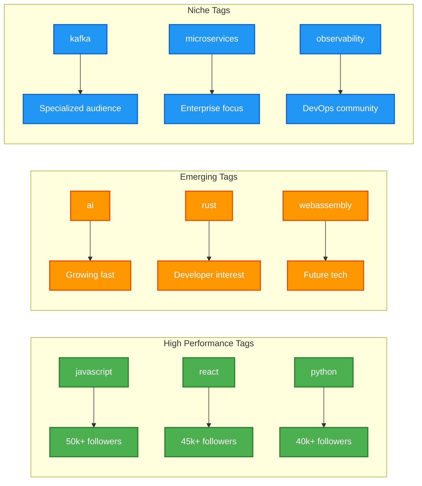

```mermaid
graph LR
    subgraph "Research Phase"
        A1[Search Trending Tags] --> A2[Analyze Popular Content]
        A2 --> A3[Identify Content Gaps]
    end
    
    subgraph "Creation Phase" 
        B1[Draft Article] --> B2[Add SEO Elements]
        B2 --> B3[Optimize for Engagement]
    end
    
    subgraph "Publication Phase"
        C1[Publish as Draft] --> C2[Review & Edit]
        C2 --> C3[Publish Final Version]
    end
    
    subgraph "Engagement Phase"
        D1[Monitor Comments] --> D2[Respond to Community]
        D2 --> D3[Update Based on Feedback]
    end
    
    A3 --> B1
    B3 --> C1
    C3 --> D1
    
    classDef research fill:#4CAF50,stroke:#2E7D32,stroke-width:2px,color:#fff
    classDef creation fill:#2196F3,stroke:#1565C0,stroke-width:2px,color:#fff
    classDef publication fill:#FF9800,stroke:#E65100,stroke-width:2px,color:#fff
    classDef engagement fill:#9C27B0,stroke:#6A1B9A,stroke-width:2px,color:#fff
    
    class A1,A2,A3 research
    class B1,B2,B3 creation
    class C1,C2,C3 publication
    class D1,D2,D3 engagement
```

# 📝 Dev Blog MCP Server - Prompt Examples

## Overview
Practical examples demonstrating how to use the Dev Blog MCP Server tools for real-world content management scenarios.

---

## 🎯 Example 1: Research & Publish Article About Kafka vs RabbitMQ

### Step 1: Get Related Tags
**Prompt:**
```
I want to write an article about Kafka vs RabbitMQ. First, help me find relevant tags for this topic.
```

**MCP Tool Call:**
```json
{
  "name": "get_tags",
  "arguments": {
    "per_page": 20,
    "page": 1
  }
}
```

**Expected Response:**
```json
[
  {"name": "kafka", "bg_color_hex": "#000000", "text_color_hex": "#ffffff"},
  {"name": "rabbitmq", "bg_color_hex": "#ff6600", "text_color_hex": "#ffffff"}, 
  {"name": "messagequeue", "bg_color_hex": "#1e90ff", "text_color_hex": "#ffffff"},
  {"name": "microservices", "bg_color_hex": "#32cd32", "text_color_hex": "#ffffff"},
  {"name": "distributed", "bg_color_hex": "#8a2be2", "text_color_hex": "#ffffff"},
  {"name": "backend", "bg_color_hex": "#ff1493", "text_color_hex": "#ffffff"}
]
```

### Step 2: Research Existing Articles
**Prompt:**
```
Now search for existing articles about Kafka and RabbitMQ to understand what's already been written and find inspiration.
```

**MCP Tool Call:**
```json
{
  "name": "search_articles",
  "arguments": {
    "query": "kafka rabbitmq comparison",
    "per_page": 10,
    "tag": "kafka"
  }
}
```

### Step 3: Create the Article
**Prompt:**
```
Create a comprehensive article comparing Kafka vs RabbitMQ. Make it beginner-friendly but technically accurate.
```

**MCP Tool Call:**
```json
{
  "name": "create_article",
  "arguments": {
    "title": "Kafka vs RabbitMQ: Choosing the Right Message Broker for Your Project",
    "body_markdown": "# Kafka vs RabbitMQ: Choosing the Right Message Broker\n\nWhen building distributed systems, choosing the right message broker is crucial for your application's performance and scalability...\n\n## What is Apache Kafka?\n\nApache Kafka is a distributed streaming platform designed for high-throughput, fault-tolerant event streaming...\n\n## What is RabbitMQ?\n\nRabbitMQ is a traditional message broker that implements the Advanced Message Queuing Protocol (AMQP)...\n\n## Key Differences\n\n### Performance & Throughput\n- **Kafka**: Designed for high throughput (millions of messages/second)\n- **RabbitMQ**: Lower throughput but more flexible routing\n\n### Use Cases\n- **Kafka**: Event streaming, log aggregation, real-time analytics\n- **RabbitMQ**: Task queues, request/response patterns, complex routing\n\n### Learning Curve\n- **Kafka**: Steeper learning curve, more complex setup\n- **RabbitMQ**: Easier to get started, familiar patterns\n\n## Conclusion\n\nChoose Kafka for high-throughput streaming and analytics. Choose RabbitMQ for traditional messaging patterns and easier setup.\n\n## Resources\n- [Kafka Documentation](https://kafka.apache.org/documentation/)\n- [RabbitMQ Tutorials](https://www.rabbitmq.com/tutorials.html)",
    "published": true,
    "tags": ["kafka", "rabbitmq", "microservices", "backend"],
    "description": "A comprehensive comparison between Apache Kafka and RabbitMQ message brokers, helping developers choose the right tool for their distributed systems.",
    "main_image": "https://picsum.photos/1200/630?random=1"
  }
}
```

---

## 📊 Workflow Visualization



---

## 🎯 Example 2: Content Management Workflow

### Update Existing Article
**Prompt:**
```
I need to update my article about React hooks with new information about React 18 features.
```

**Step 1: Find the Article**
```json
{
  "name": "search_articles",
  "arguments": {
    "query": "react hooks",
    "username": "your_username"
  }
}
```

**Step 2: Get Article Details**
```json
{
  "name": "get_article",
  "arguments": {
    "article_id": "123456"
  }
}
```

**Step 3: Update the Article**
```json
{
  "name": "update_article",
  "arguments": {
    "article_id": "123456",
    "body_markdown": "# React Hooks: Complete Guide (Updated for React 18)\n\n...existing content...\n\n## New in React 18\n\n### Concurrent Features\n- useTransition hook for non-blocking updates\n- useDeferredValue for performance optimization\n\n...rest of updated content...",
    "tags": ["react", "hooks", "react18", "javascript"]
  }
}
```

---

## 📈 Content Strategy Flow



---

## 🎯 Example 3: Community Engagement

### Analyze Article Performance
**Prompt:**
```
Check the comments on my latest article and analyze community engagement.
```

**MCP Tool Call:**
```json
{
  "name": "get_comments",
  "arguments": {
    "article_id": "123456"
  }
}
```

**Follow-up Analysis:**
```json
{
  "name": "search_articles", 
  "arguments": {
    "query": "kafka",
    "top": 7,
    "per_page": 5
  }
}
```

---

## 🔄 Advanced Workflow Examples

### 1. Series Creation Workflow


### 2. Content Update Pipeline


---

## 🏷️ Tag Strategy Examples

### Popular Tag Combinations
```json
// Backend/Infrastructure Articles
["backend", "microservices", "docker", "kubernetes"]

// Frontend Development
["javascript", "react", "typescript", "webdev"]

// Database & Data
["database", "postgresql", "mongodb", "sql"]

// DevOps & Tools
["devops", "ci", "aws", "terraform"]
```

### Tag Performance Analysis


---

## 🎯 Best Practices

### 1. **Content Research**
- Always check existing articles before writing
- Use trending tags for better visibility
- Analyze top-performing content in your niche

### 2. **Publication Strategy**
- Start with drafts for complex articles
- Use descriptive titles and descriptions
- Include relevant main images

### 3. **Community Engagement**
- Monitor comments regularly
- Update articles based on feedback
- Build series for comprehensive topics

### 4. **SEO Optimization**
- Use 2-4 relevant tags maximum
- Write compelling descriptions
- Include canonical URLs for cross-posts

---

*Dev Blog MCP Server Examples - From idea to published article! 📝*
