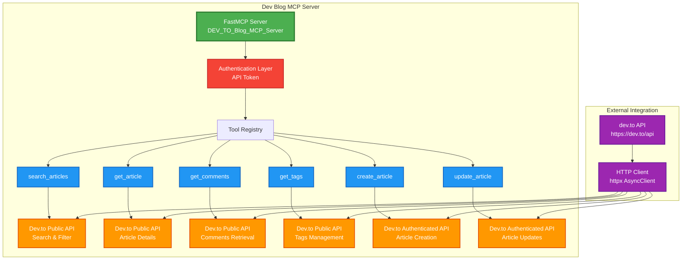
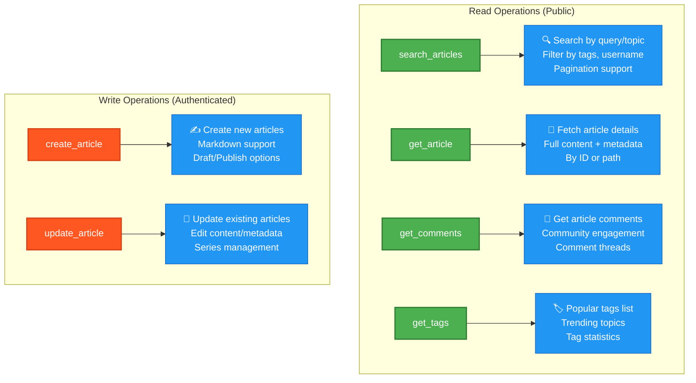
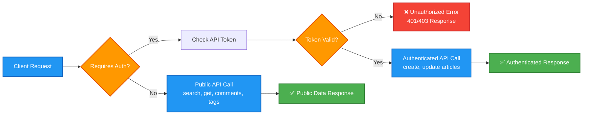
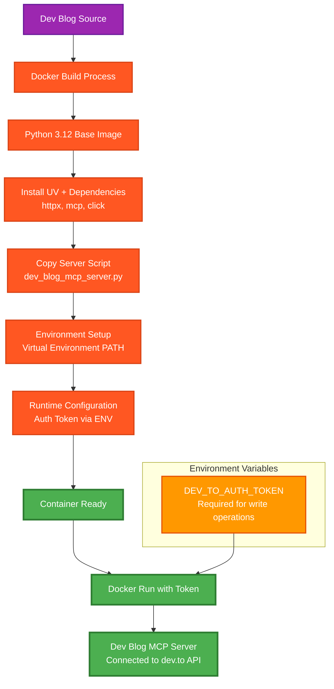
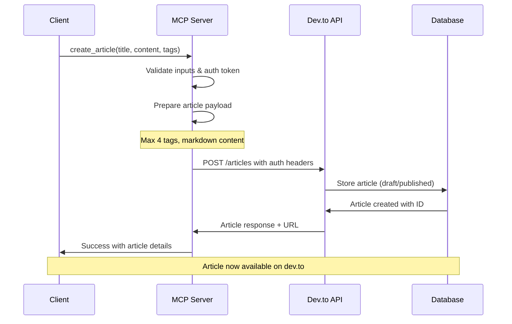
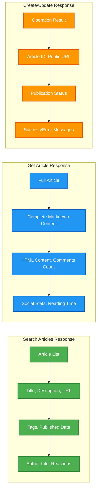

# 📝 Dev Blog MCP Server Architecture

## Overview
The Dev Blog MCP Server provides comprehensive dev.to blog management capabilities through MCP interface with full CRUD operations.

---

## 🏗️ Server Architecture



---

## 🔧 Tool Categories



---

## 🔐 Authentication & Security Flow



---

## 🐳 Docker Deployment Architecture



---

## 🔄 Article Creation Workflow



---

## 📊 API Response Data Flow



---

## 📋 Quick Commands

### Build & Run
```bash
# Build Docker image
docker build -f devBlogMcp.Dockerfile -t dev-blog-mcp .

# Run with auth token
docker run -i --rm -e DEV_TO_AUTH_TOKEN=your_token dev-blog-mcp

# Direct Python execution
DEV_TO_AUTH_TOKEN=your_token uv run python dev_blog_mcp_server.py
```

### Tool Usage Examples
```json
{
  "name": "search_articles",
  "arguments": {
    "query": "react hooks",
    "per_page": 5,
    "tag": "javascript"
  }
}

{
  "name": "create_article",
  "arguments": {
    "title": "My Dev Article",
    "body_markdown": "# Hello World\nThis is my article content...",
    "published": false,
    "tags": ["tutorial", "beginners"]
  }
}
```

---

## 🎯 Key Features

- 🔍 **Advanced Search**: Query articles by topic, tags, username
- 📄 **Full Article Access**: Complete content and metadata retrieval
- ✍️ **Content Creation**: Create and publish articles with markdown
- 📝 **Content Management**: Update existing articles and metadata
- 💬 **Community Data**: Access comments and engagement metrics
- 🏷️ **Tag Management**: Discover and use popular tags
- 🔐 **Secure Operations**: Token-based authentication for write operations
- 📊 **Rich Responses**: Detailed article data and statistics
- 🚫 **Error Handling**: Comprehensive error reporting and rate limiting
- 🐳 **Docker Ready**: Containerized deployment with environment configuration

---

*Dev Blog MCP Server - Your gateway to dev.to content management! 📝*
