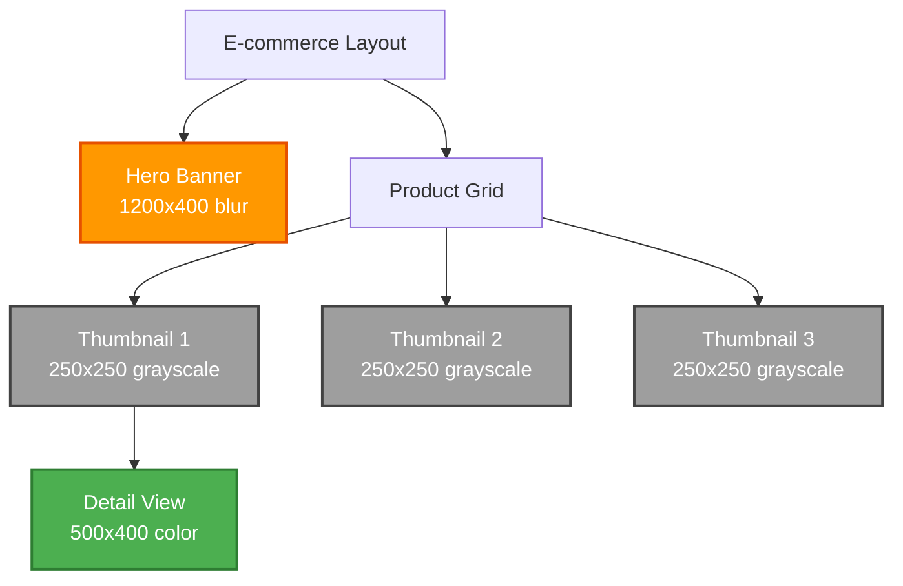
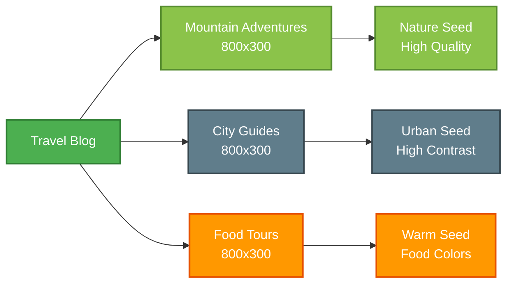
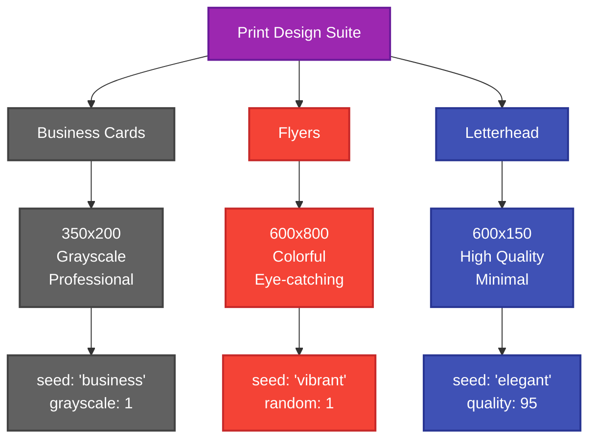
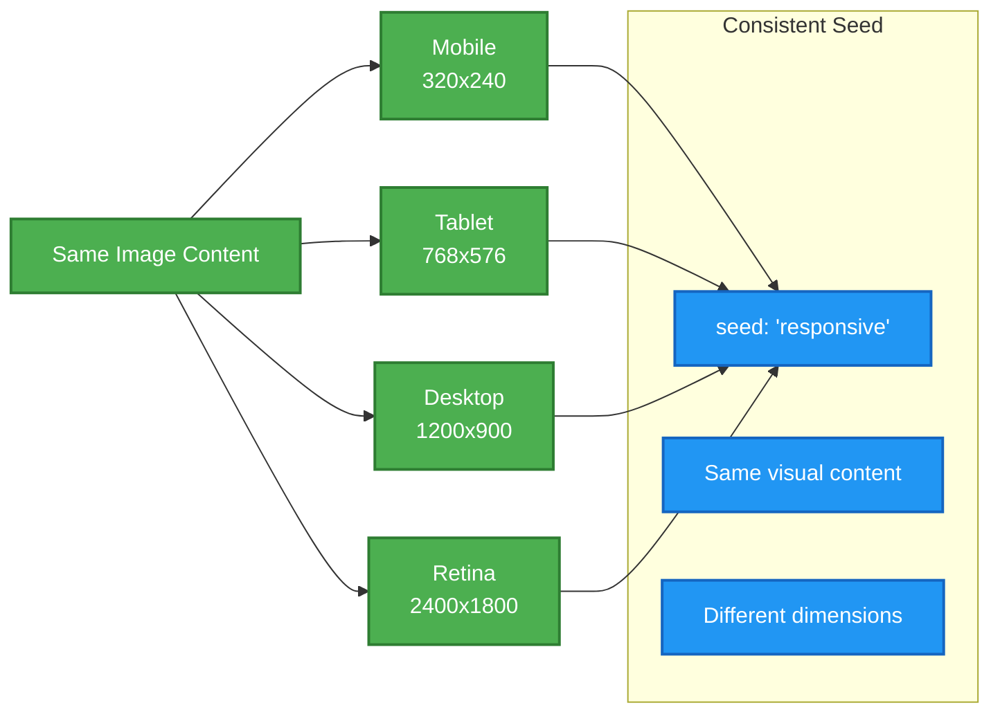
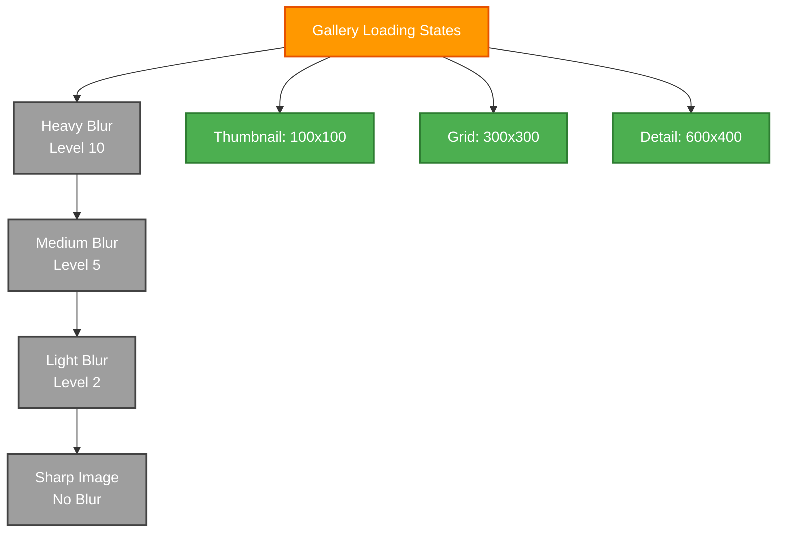
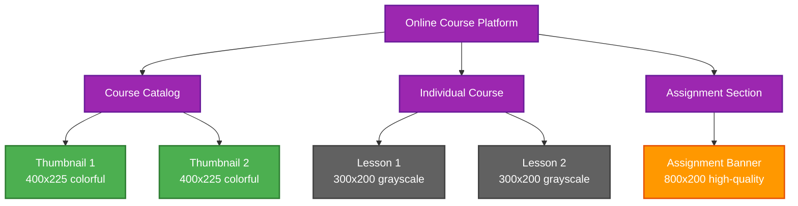
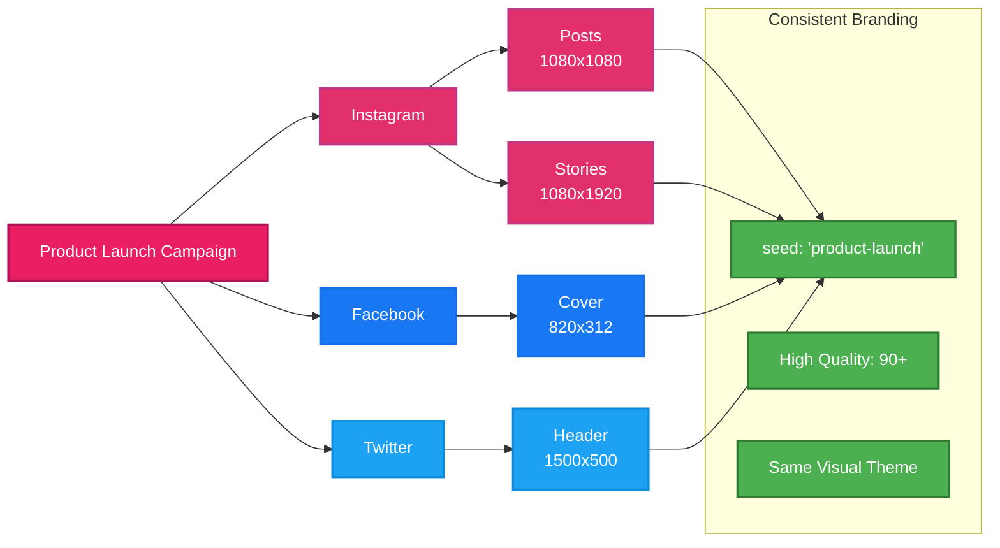
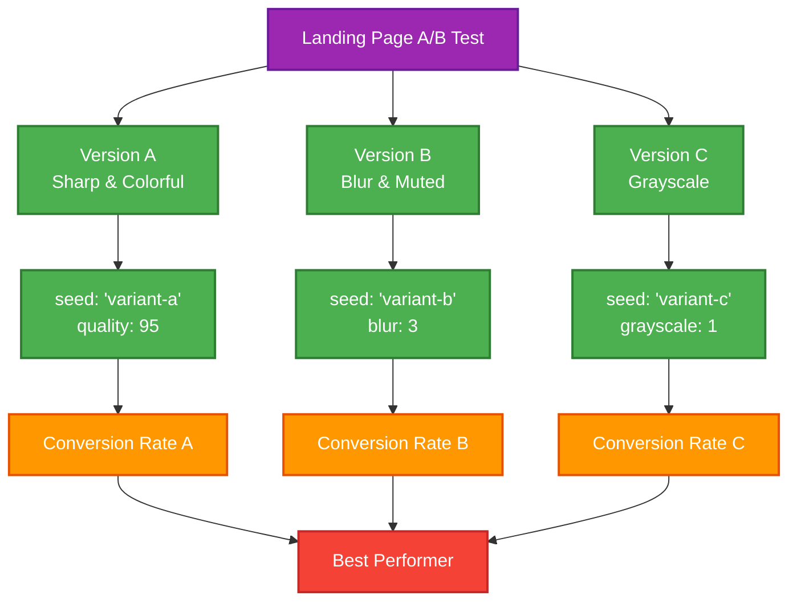
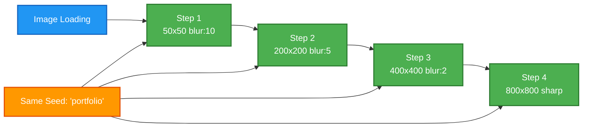
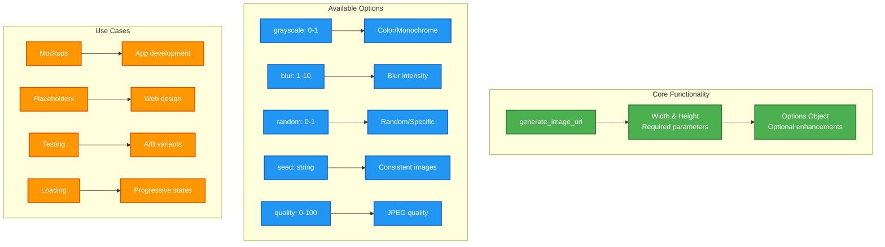

# 🖼️ Image Generator MCP Server - Practical Examples

## Overview
This document provides real-world prompt examples for using the Image Generator MCP Server, demonstrating various Lorem Picsum image generation scenarios.

---

## 📱 App Development Mockups

### Example 1: Social Media App Placeholders
```
I'm building a social media app and need placeholder images for the user interface:
- Profile pictures: 150x150 pixels
- Post images: 400x300 pixels  
- Story thumbnails: 100x100 pixels

Generate these placeholder images for my app mockup.
```

**Expected MCP Tool Calls:**
```json
{
  "method": "tools/call",
  "params": {
    "name": "generate_image_url",
    "arguments": {
      "width": 150,
      "height": 150,
      "options": {"seed": "profile1"}
    }
  }
}
```

**Generated URLs:**
- Profile: `https://picsum.photos/150/150?seed=profile1`
- Post: `https://picsum.photos/400/300?seed=post1`
- Story: `https://picsum.photos/100/100?seed=story1`

---

### Example 2: E-commerce Product Grid
```
Create placeholder images for an e-commerce website:
- Product thumbnails: 250x250 (square format)
- Product details: 500x400 (landscape)
- Hero banner: 1200x400 (wide banner)

Make the thumbnails grayscale and add slight blur to the hero banner.
```

**Image Grid Layout:**


**MCP Tool Calls:**
1. Hero: `generate_image_url(1200, 400, {"blur": "2"})`
2. Thumbs: `generate_image_url(250, 250, {"grayscale": "1", "seed": "product1"})`
3. Detail: `generate_image_url(500, 400, {"seed": "product1"})`

---

## 🎨 Design & Creative Projects

### Example 3: Blog Post Headers
```
I'm writing a travel blog and need header images for different articles:
- "Mountain Adventures": 800x300 landscape
- "City Guides": 800x300 urban feel
- "Food Tours": 800x300 appetizing

Each should have a different aesthetic and be optimized for web.
```

**Blog Header Collection:**


**MCP Tool Sequence:**
1. `generate_image_url(800, 300, {"seed": "mountain", "quality": "90"})`
2. `generate_image_url(800, 300, {"seed": "city", "quality": "90"})`
3. `generate_image_url(800, 300, {"seed": "food", "quality": "90"})`

---

### Example 4: Print Design Templates
```
I need background images for print materials:
- Business cards: 350x200 (subtle, professional)
- Flyers: 600x800 (eye-catching, vibrant)
- Letterhead: 600x150 (minimal, elegant)

The business cards should be grayscale, flyers should be colorful, letterhead should be high quality.
```

**Print Material Specifications:**


**MCP Tool Calls:**
1. Cards: `generate_image_url(350, 200, {"grayscale": "1", "seed": "business"})`
2. Flyers: `generate_image_url(600, 800, {"random": "1", "seed": "vibrant"})`
3. Header: `generate_image_url(600, 150, {"quality": "95", "seed": "elegant"})`

---

## 🌐 Web Development

### Example 5: Responsive Image Sets
```
I need placeholder images for a responsive website:
- Mobile: 320x240
- Tablet: 768x576  
- Desktop: 1200x900
- Retina: 2400x1800

All should use the same seed for consistency but different sizes.
```

**Responsive Breakpoints:**


**MCP Tool Sequence:**
1. `generate_image_url(320, 240, {"seed": "responsive"})`
2. `generate_image_url(768, 576, {"seed": "responsive"})`
3. `generate_image_url(1200, 900, {"seed": "responsive"})`
4. `generate_image_url(2400, 1800, {"seed": "responsive"})`

---

### Example 6: Loading States & Placeholders
```
Create loading placeholder images for a photo gallery:
- Gallery grid: 300x300 squares
- Detail view: 600x400 landscape
- Thumbnails: 100x100 small squares

Use blur effect to simulate loading state, with different blur levels.
```

**Loading State Progression:**


**MCP Blur Progression:**
1. `generate_image_url(300, 300, {"blur": "10", "seed": "gallery"})`
2. `generate_image_url(300, 300, {"blur": "5", "seed": "gallery"})`
3. `generate_image_url(300, 300, {"blur": "2", "seed": "gallery"})`
4. `generate_image_url(300, 300, {"seed": "gallery"})`

---

## 📖 Content Creation

### Example 7: Educational Materials
```
I'm creating an online course and need placeholder images:
- Course thumbnails: 400x225 (16:9 aspect ratio)
- Lesson previews: 300x200 (3:2 aspect ratio)  
- Assignment headers: 800x200 (4:1 banner)

Make thumbnails colorful, previews grayscale, and headers high quality.
```

**Educational Content Layout:**


**MCP Tool Calls:**
1. Thumbnails: `generate_image_url(400, 225, {"seed": "course1", "random": "1"})`
2. Lessons: `generate_image_url(300, 200, {"grayscale": "1", "seed": "lesson1"})`
3. Assignments: `generate_image_url(800, 200, {"quality": "95", "seed": "assignment"})`

---

## 🎪 Event & Marketing

### Example 8: Social Media Campaign
```
Create a series of images for a product launch campaign:
- Instagram posts: 1080x1080 (square)
- Instagram stories: 1080x1920 (vertical)
- Facebook covers: 820x312 (wide banner)
- Twitter headers: 1500x500 (3:1 ratio)

All should maintain visual consistency with the same seed but optimized for each platform.
```

**Social Media Asset Grid:**


**Campaign Asset Generation:**
1. IG Post: `generate_image_url(1080, 1080, {"seed": "product-launch", "quality": "90"})`
2. IG Story: `generate_image_url(1080, 1920, {"seed": "product-launch", "quality": "90"})`
3. FB Cover: `generate_image_url(820, 312, {"seed": "product-launch", "quality": "90"})`
4. Twitter: `generate_image_url(1500, 500, {"seed": "product-launch", "quality": "90"})`

---

## 🖼️ Advanced Image Techniques

### Example 9: A/B Testing Variants
```
I need to test different image styles for my landing page hero:
- Version A: Sharp, colorful image (1200x600)
- Version B: Subtle blur, muted colors (1200x600)  
- Version C: Grayscale, high contrast (1200x600)

All should use different seeds but same dimensions for fair comparison.
```

**A/B Testing Setup:**


**A/B Test Image Generation:**
1. Version A: `generate_image_url(1200, 600, {"seed": "variant-a", "quality": "95"})`
2. Version B: `generate_image_url(1200, 600, {"seed": "variant-b", "blur": "3"})`
3. Version C: `generate_image_url(1200, 600, {"seed": "variant-c", "grayscale": "1"})`

---

### Example 10: Progressive Image Loading
```
Implement progressive loading for a photography portfolio:
- Start with 50x50 heavily blurred thumbnail
- Progress to 200x200 medium blur
- Load 400x400 light blur  
- Finally show 800x800 sharp image

Use same seed throughout for consistency.
```

**Progressive Loading Sequence:**


**Progressive Load Calls:**
1. `generate_image_url(50, 50, {"seed": "portfolio", "blur": "10"})`
2. `generate_image_url(200, 200, {"seed": "portfolio", "blur": "5"})`
3. `generate_image_url(400, 400, {"seed": "portfolio", "blur": "2"})`
4. `generate_image_url(800, 800, {"seed": "portfolio"})`

---

## 🔧 Image Generator Features



---

## 🚀 Quick Testing Commands

```bash
# Test the image generator server
cd /Users/elsayed/side-projects/sessions/stdio_mcp_server

# Start the image generator server
uv run python image_generator_mcp_server.py

# In another terminal, test with MCP client
cd ../mcp_client
uv run python client.py ../stdio_mcp_server/image_generator_mcp_server.py

# Example client commands:
# generate_image_url 400 300
# generate_image_url 800 600 '{"grayscale": "1"}'
# generate_image_url 1200 800 '{"blur": "3", "seed": "test"}'
# generate_image_url 300 300 '{"quality": "95", "random": "1"}'
```

---

## 💡 Pro Tips

### Best Practices:
- **Consistent Seeds**: Use same seed for related images
- **Quality Settings**: Use 90+ for final production images  
- **Progressive Loading**: Start blurred, progress to sharp
- **A/B Testing**: Use different seeds for fair comparison
- **Responsive Design**: Generate multiple sizes with same seed

### Common Patterns:
- **Hero Images**: 1200x600 with high quality
- **Thumbnails**: 300x300 or smaller, can use grayscale
- **Social Media**: Platform-specific dimensions
- **Loading States**: Multiple blur levels with same seed
- **Print Materials**: Higher quality settings (95+)

---

*Image Generator MCP Server - Beautiful placeholders for every project! 🖼️*
