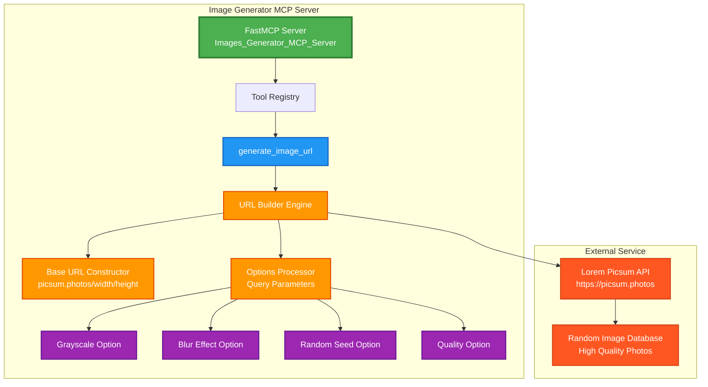
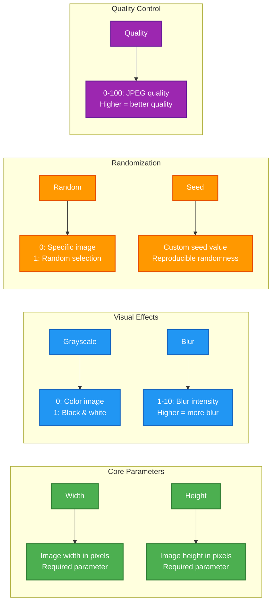
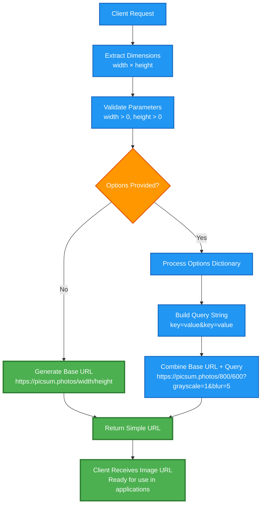
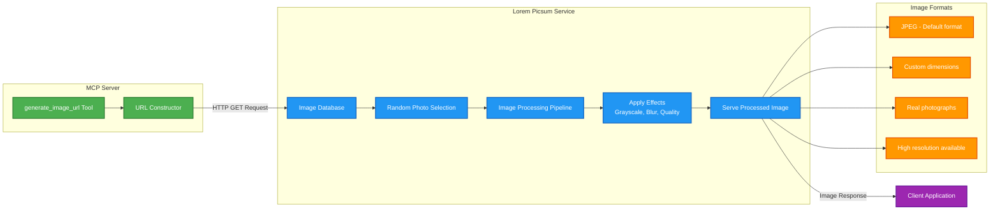
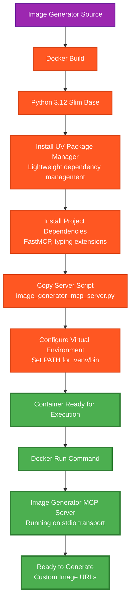
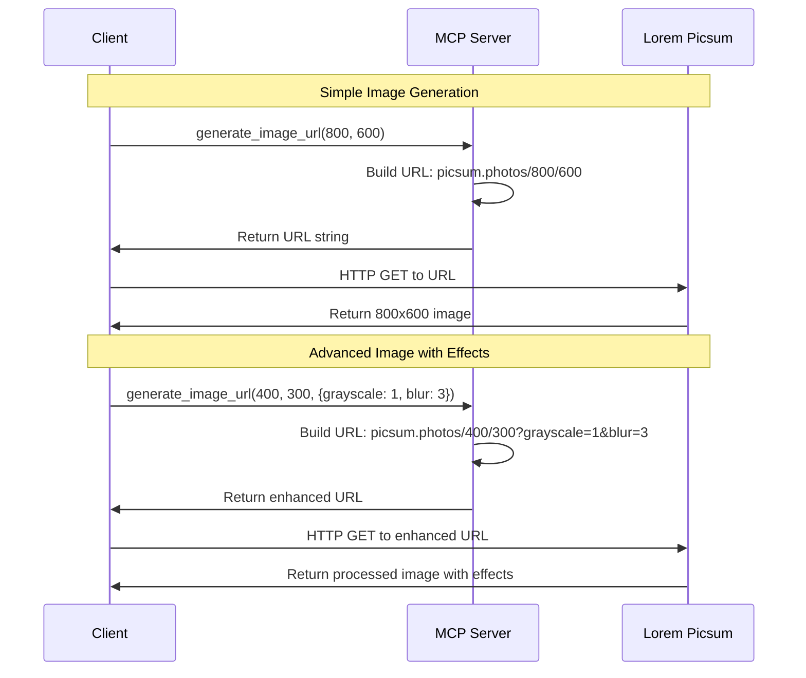
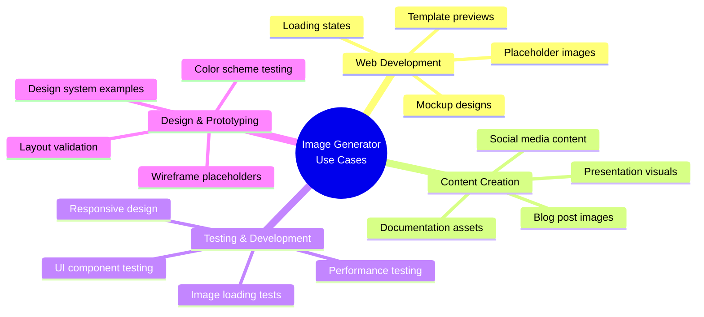

# 🎨 Image Generator MCP Server Architecture

## Overview
The Image Generator MCP Server provides dynamic image URL generation using Lorem Picsum service through a simple MCP interface.

---

## 🏗️ Server Architecture



---

## 🎛️ Image Customization Options



---

## 🔧 URL Generation Process



---

## 🌐 Lorem Picsum Integration



---

## 🐳 Docker Deployment Flow



---

## 🔄 Request/Response Examples



---

## 📋 Quick Commands

### Build & Run
```bash
# Build Docker image
docker build -f imageGeneratorMcp.Dockerfile -t image-generator-mcp .

# Run container
docker run -i --rm image-generator-mcp

# Direct Python execution
uv run python image_generator_mcp_server.py
```

### Tool Usage Examples
```json
{
  "name": "generate_image_url",
  "arguments": {
    "width": 800,
    "height": 600
  }
}
// Returns: "https://picsum.photos/800/600"

{
  "name": "generate_image_url",
  "arguments": {
    "width": 400,
    "height": 300,
    "options": {
      "grayscale": "1",
      "blur": "5",
      "random": "1"
    }
  }
}
// Returns: "https://picsum.photos/400/300?grayscale=1&blur=5&random=1"
```

---

## 🎯 Use Cases & Applications



---

## 🎯 Key Features

- 🖼️ **Dynamic Image URLs**: Generate custom-sized image URLs instantly
- 🎨 **Visual Effects**: Grayscale, blur, and quality control options
- 🎲 **Randomization**: Random images with optional seed control
- 📐 **Custom Dimensions**: Any width and height combination
- 🚀 **Lightning Fast**: URL generation without image processing delays
- 🌐 **External Integration**: Leverages Lorem Picsum's robust image service
- 🐳 **Container Ready**: Docker deployment for easy scaling
- 💡 **Simple Interface**: Single tool with comprehensive options
- 🔧 **Developer Friendly**: Perfect for prototyping and testing
- 📱 **Responsive Ready**: Generate images for different screen sizes

---

## 🌟 Advanced Examples

```javascript
// Web development placeholder
generate_image_url(1200, 400, {quality: "90"})
// Perfect for hero sections

// Social media content
generate_image_url(1080, 1080, {grayscale: "1"}) 
// Instagram-ready square images

// Blog thumbnails with effects
generate_image_url(600, 400, {blur: "2", seed: "blog-post-123"})
// Consistent blur effect for article headers
```

---

*Image Generator MCP Server - Beautiful placeholder images at your fingertips! 🎨*
