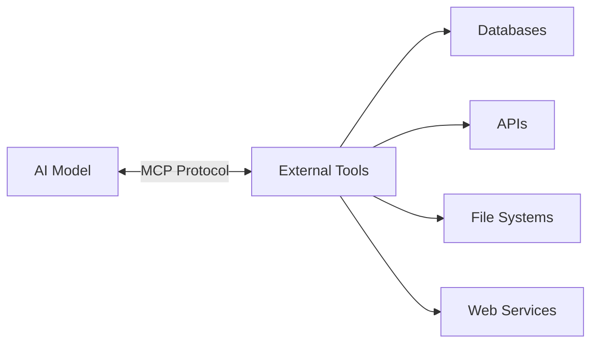
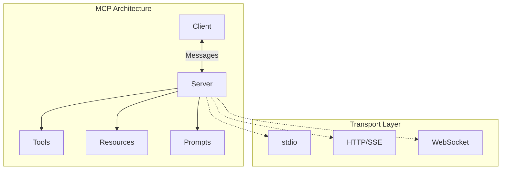
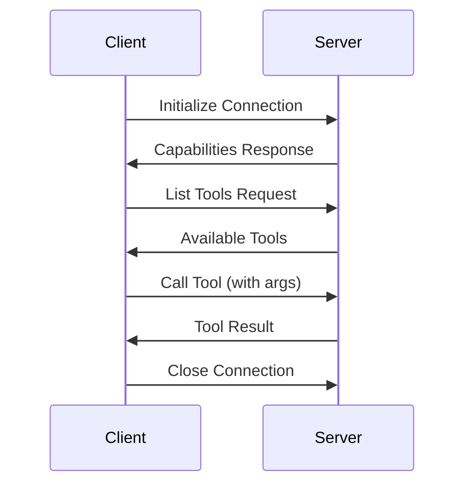
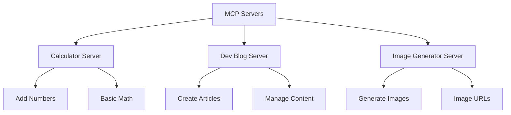
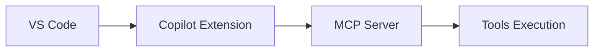
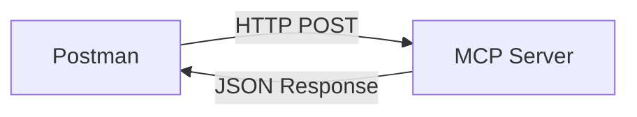
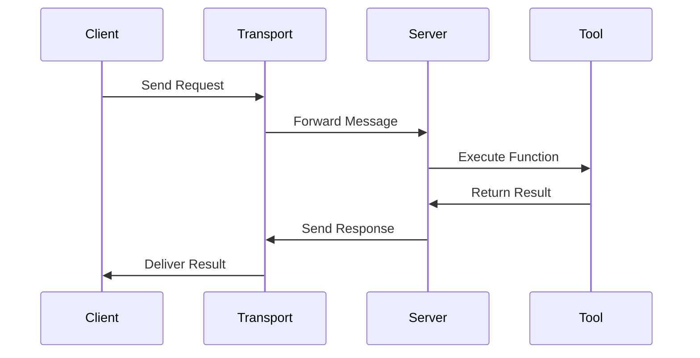
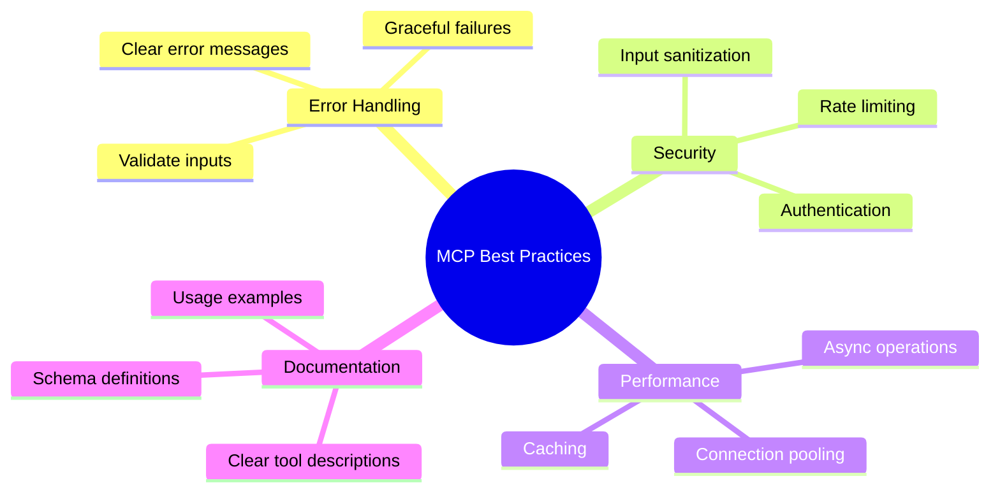

# Model Context Protocol (MCP) - Complete Guide

---

## Slide 1: What is MCP?

**Model Context Protocol (MCP)** is a standardized protocol that enables AI models to securely connect and interact with external data sources and tools.



**Key Benefits:**
- 🔒 Secure communication
- 🔌 Standardized interface
- 🚀 Easy integration
- 📦 Tool modularity

---

## Slide 2: MCP Main Components



**Components:**
- **Client**: AI model or application consuming MCP services
- **Server**: Provides tools and resources via MCP protocol
- **Transport**: Communication layer (stdio, HTTP, WebSocket)

---

## Slide 3: How MCP Connection Works



**Connection Flow:**
1. **Handshake**: Client connects to server
2. **Discovery**: Server lists available tools
3. **Execution**: Client calls tools with arguments
4. **Response**: Server returns results

---

## Slide 4: Simple MCP Server Example

```python
from mcp.server import Server
from mcp.types import Tool, TextContent

server = Server("calculator")

@server.list_tools()
async def list_tools() -> list[Tool]:
    return [Tool(
        name="sum_two_numbers",
        description="Add two numbers",
        inputSchema={
            "type": "object",
            "properties": {
                "a": {"type": "number"},
                "b": {"type": "number"}
            }
        }
    )]

@server.call_tool()
async def call_tool(name: str, arguments: dict):
    if name == "sum_two_numbers":
        result = arguments["a"] + arguments["b"]
        return [TextContent(type="text", text=f"Sum: {result}")]
```

---

## Slide 5: MCP Server Types in Our Project



**Available Servers:**
- 🧮 **Calculator**: Mathematical operations
- 📝 **Dev Blog**: Article management
- 🎨 **Image Generator**: Image creation tools

---

**Benefits:**
- 🔧 Consistent environment
- 📦 Easy deployment
- 🚀 Scalable

---

## Slide 6: Testing MCP Servers

### Method 1: VS Code Copilot Extension



**Steps:**
1. Install MCP extension in VS Code
2. Configure server endpoint
3. Test tools directly in editor

### Method 2: Direct Client Testing

```python
# Using our mcp_client
python mcp_client/client.py
```

---

## Slide 7: Testing with Postman (HTTP Transport)



**Request Example:**
```json
POST /mcp/tools/call
{
  "method": "tools/call",
  "params": {
    "name": "sum_two_numbers",
    "arguments": {"a": 5, "b": 3}
  }
}
```

**Response:**
```json
{
  "result": [
    {
      "type": "text",
      "text": "Sum: 8"
    }
  ]
}
```

---

## Slide 8: MCP Message Flow



**Message Types:**
- 📋 `tools/list` - Get available tools
- ⚡ `tools/call` - Execute specific tool
- 📄 `resources/list` - Get resources
- 🔍 `prompts/list` - Get prompts

---

## Slide 9: Project Structure & Running

```
stdio_mcp_server/
├── 🧮 calculator_mcp_server.py     # Math operations
├── 📝 dev_blog_mcp_server.py       # Blog management  
├── 🎨 image_generator_mcp_server.py # Image generation
├── 🐳 *.Dockerfile                 # Docker configs
└── 📦 pyproject.toml               # Dependencies
```

**Quick Start:**
```bash
# Install dependencies
uv sync

# Run calculator server
uv run python ultra_minimal_server.py

# Build & run with Docker
docker build -f calculatorMcp.Dockerfile -t calc-mcp .
docker run -i --rm calc-mcp
```

---

## Slide 10: Best Practices for MCP Development



**Key Points:**
- ✅ Always validate tool inputs
- 🛡️ Implement proper error handling
- 📚 Document your tools clearly
- ⚡ Use async for better performance

---

## Slide 11: Summary & Next Steps

**What We Covered:**
- 🎯 MCP protocol fundamentals
- 🏗️ Core components and architecture
- 💻 Simple server implementation
- 🧪 Testing strategies
- 🐳 Docker deployment

**Next Steps:**
1. **Practice**: Try running our example servers
2. **Build**: Create your own MCP tools
3. **Test**: Use VS Code extension or Postman
4. **Deploy**: Containerize with Docker
5. **Scale**: Add more complex tools and resources

**Resources:**
- [MCP Official Docs](https://modelcontextprotocol.io)
- [GitHub Examples](https://github.com/modelcontextprotocol)
- Our project servers for reference

---

*Happy MCP Development! 🚀*
