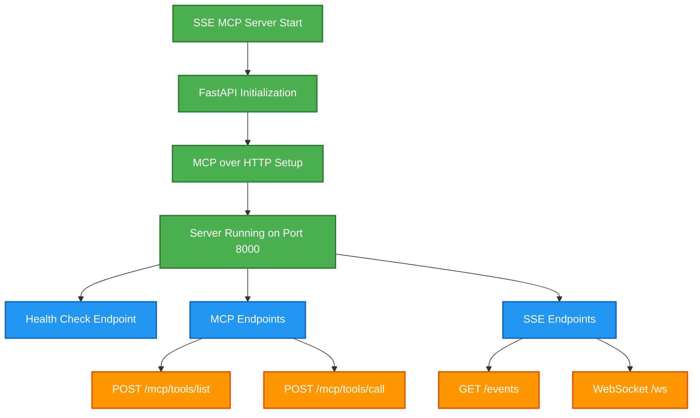
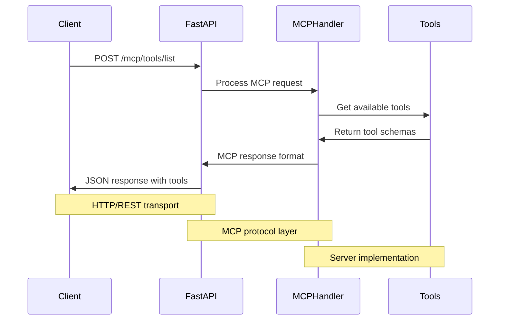
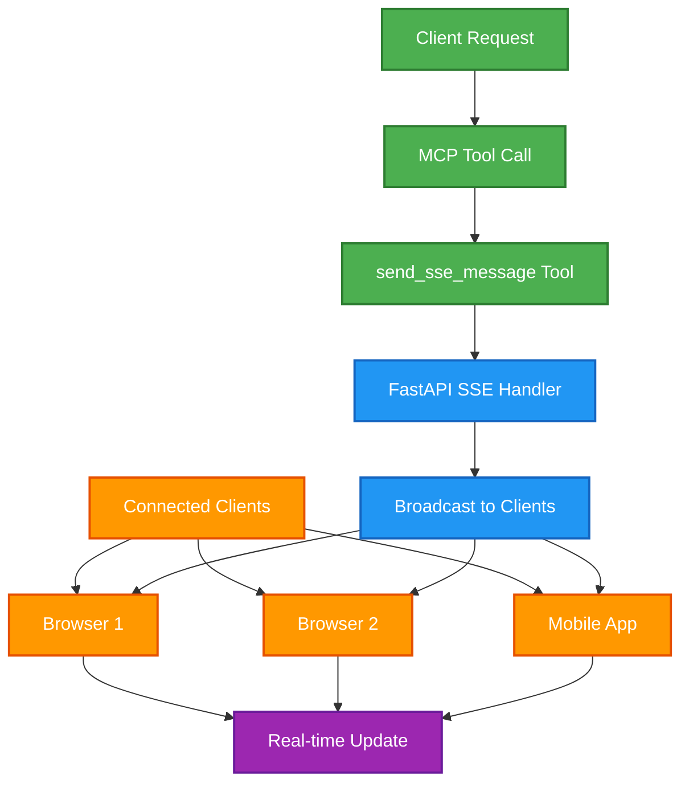
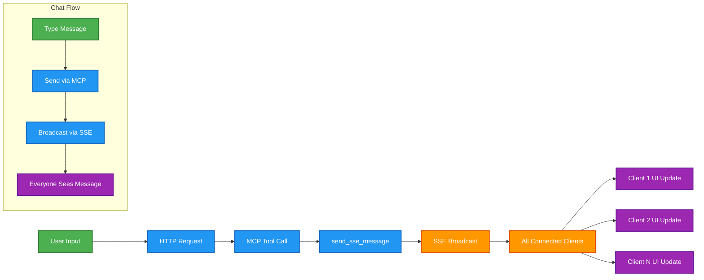
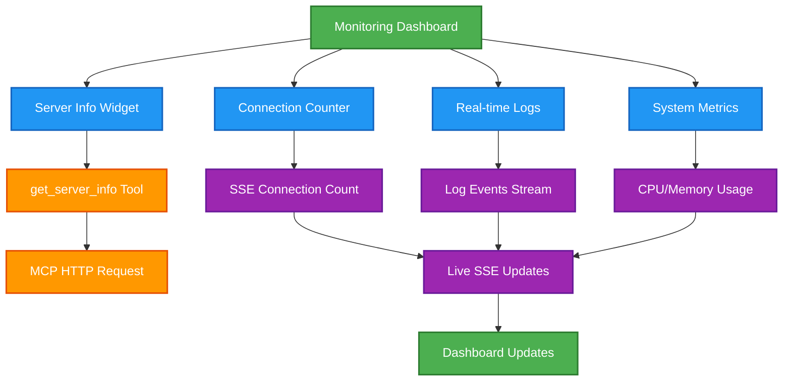
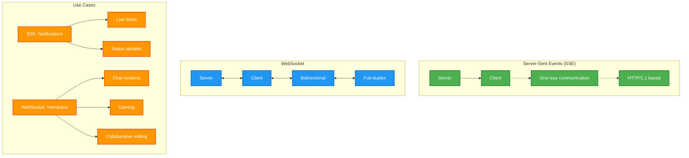
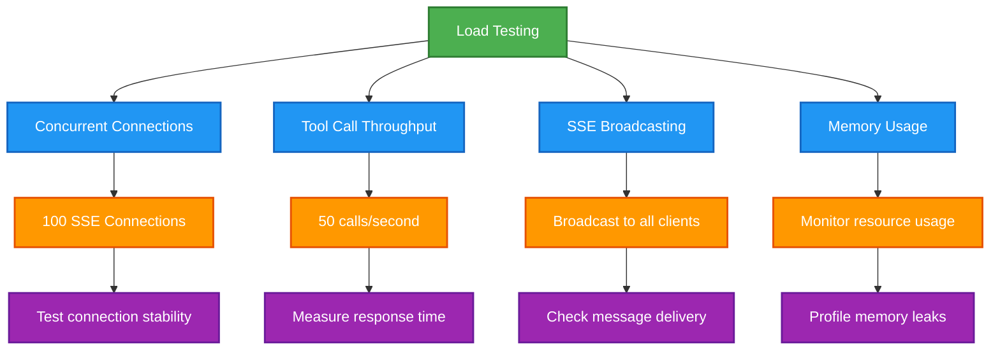
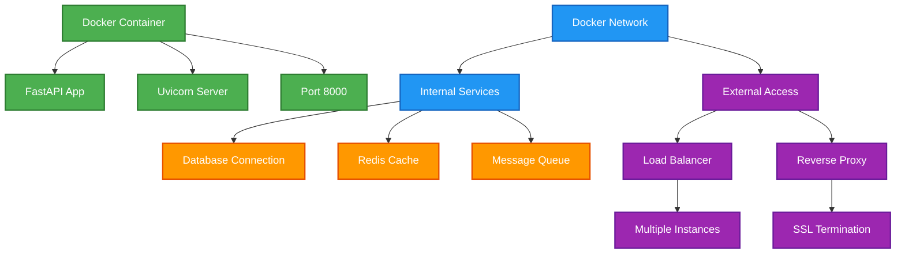
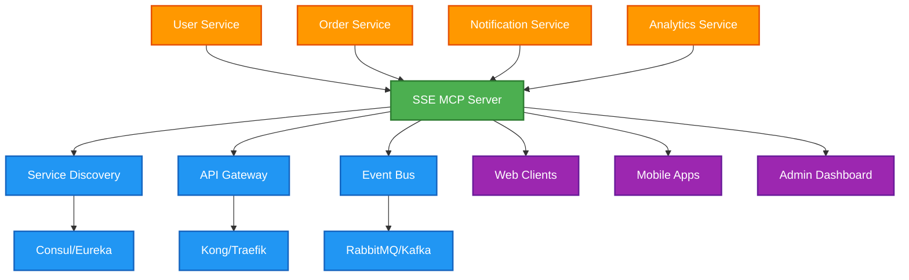
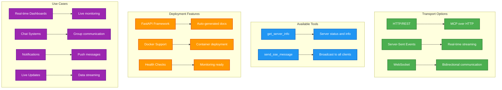

# 🌊 SSE MCP Server - Practical Examples

## Overview
This document provides real-world prompt examples for using the SSE (Server-Sent Events) MCP Server, demonstrating HTTP-based MCP communication and FastAPI integration.

---

## 🌐 HTTP-Based MCP Communication

### Example 1: Testing HTTP MCP Transport
```
I want to test the SSE MCP server that uses HTTP instead of STDIO.
How do I connect to it and verify the HTTP-based MCP protocol is working?

Start the server and show me how to make HTTP MCP requests.
```

**Server Startup Sequence:**


**HTTP Testing:**
```bash
# Start the SSE server
cd /Users/elsayed/side-projects/sessions/sse_server
uv run python main.py

# Test with curl (in another terminal)
curl http://localhost:8000/health

# Test MCP tool discovery
curl -X POST http://localhost:8000/mcp/tools/list \
  -H "Content-Type: application/json" \
  -d '{}'
```

---

### Example 2: MCP Tool Discovery via HTTP
```
Query the SSE MCP server to see what tools are available.
I want to understand how tool discovery works over HTTP instead of STDIO.
```

**HTTP MCP Tool Discovery:**


**Example HTTP Request:**
```bash
curl -X POST http://localhost:8000/mcp/tools/list \
  -H "Content-Type: application/json" \
  -d '{
    "jsonrpc": "2.0",
    "id": 1,
    "method": "tools/list",
    "params": {}
  }'
```

**Expected Response:**
```json
{
  "jsonrpc": "2.0",
  "id": 1,
  "result": {
    "tools": [
      {
        "name": "get_server_info",
        "description": "Get information about the SSE MCP server",
        "inputSchema": {
          "type": "object",
          "properties": {},
          "required": []
        }
      },
      {
        "name": "send_sse_message",
        "description": "Send a message via Server-Sent Events",
        "inputSchema": {
          "type": "object",
          "properties": {
            "message": {
              "type": "string",
              "description": "The message to send"
            }
          },
          "required": ["message"]
        }
      }
    ]
  }
}
```

---

## 📡 Server-Sent Events Integration

### Example 3: Real-time Event Streaming
```
Use the SSE server to send real-time messages to connected clients.
Show me how to combine MCP tool calls with Server-Sent Events for live updates.
```

**SSE + MCP Integration:**


**MCP Tool Call for SSE:**
```bash
curl -X POST http://localhost:8000/mcp/tools/call \
  -H "Content-Type: application/json" \
  -d '{
    "jsonrpc": "2.0",
    "id": 2,
    "method": "tools/call",
    "params": {
      "name": "send_sse_message",
      "arguments": {
        "message": "Hello from MCP! Server is broadcasting this message."
      }
    }
  }'
```

**SSE Client Connection:**
```javascript
// Connect to SSE endpoint
const eventSource = new EventSource('http://localhost:8000/events');

eventSource.onmessage = function(event) {
    console.log('Received SSE message:', event.data);
    // Display real-time update in UI
};

eventSource.onerror = function(event) {
    console.error('SSE connection error:', event);
};
```

---

### Example 4: Live Chat System
```
Build a simple chat system using the SSE MCP server.
Show how MCP tools can trigger Server-Sent Events for real-time communication.
```

**Chat System Architecture:**


**Chat Message Flow:**
1. **User Types**: Message in web interface
2. **HTTP Request**: POST to MCP endpoint
3. **MCP Processing**: `send_sse_message` tool called
4. **SSE Broadcast**: Message sent to all connected clients
5. **UI Update**: All chat windows show new message

**Example Chat Messages:**
```bash
# User 1 sends a message
curl -X POST http://localhost:8000/mcp/tools/call \
  -d '{
    "method": "tools/call",
    "params": {
      "name": "send_sse_message",
      "arguments": {
        "message": "User1: Hello everyone! 👋"
      }
    }
  }'

# User 2 responds
curl -X POST http://localhost:8000/mcp/tools/call \
  -d '{
    "method": "tools/call",
    "params": {
      "name": "send_sse_message",
      "arguments": {
        "message": "User2: Hi there! Great to see you online! 😊"
      }
    }
  }'
```

---

## 🚀 Real-time Monitoring

### Example 5: Server Status Dashboard
```
Create a real-time monitoring dashboard using the SSE MCP server.
Show server status, active connections, and system metrics via Server-Sent Events.
```

**Monitoring Dashboard:**


**Server Info Request:**
```bash
curl -X POST http://localhost:8000/mcp/tools/call \
  -H "Content-Type: application/json" \
  -d '{
    "jsonrpc": "2.0",
    "id": 3,
    "method": "tools/call",
    "params": {
      "name": "get_server_info",
      "arguments": {}
    }
  }'
```

**Dashboard JavaScript:**
```javascript
// Real-time dashboard updates
const eventSource = new EventSource('http://localhost:8000/events');
const statusDiv = document.getElementById('server-status');
const connectionCount = document.getElementById('connection-count');

// Get initial server info
fetch('http://localhost:8000/mcp/tools/call', {
    method: 'POST',
    headers: {'Content-Type': 'application/json'},
    body: JSON.stringify({
        method: 'tools/call',
        params: {
            name: 'get_server_info',
            arguments: {}
        }
    })
}).then(response => response.json())
  .then(data => {
      statusDiv.innerHTML = `Server: ${data.result.content[0].text}`;
  });

// Listen for real-time updates
eventSource.onmessage = function(event) {
    const logDiv = document.getElementById('logs');
    logDiv.innerHTML += `<div>${new Date().toLocaleTimeString()}: ${event.data}</div>`;
};
```

---

## 🔧 WebSocket Integration

### Example 6: Bidirectional Communication
```
Use the WebSocket endpoint for two-way communication with the SSE MCP server.
Show how this differs from the one-way Server-Sent Events.
```

**WebSocket vs SSE Comparison:**


**WebSocket Client Example:**
```javascript
// Connect to WebSocket endpoint
const socket = new WebSocket('ws://localhost:8000/ws');

socket.onopen = function(event) {
    console.log('WebSocket connected');
    
    // Send MCP-style message via WebSocket
    socket.send(JSON.stringify({
        type: 'mcp_call',
        tool: 'send_sse_message',
        arguments: {
            message: 'Hello from WebSocket client!'
        }
    }));
};

socket.onmessage = function(event) {
    const data = JSON.parse(event.data);
    console.log('Received:', data);
};

socket.onclose = function(event) {
    console.log('WebSocket closed');
};
```

---

## 🛠️ Development & Testing

### Example 7: HTTP MCP Client Development
```
I'm building a client that connects to MCP servers over HTTP instead of STDIO.
Show me how to implement an HTTP MCP client using the SSE server.
```

**HTTP MCP Client Architecture:**
```mermaid
graph TD
    A[HTTP MCP Client] --> B[Tool Discovery]
    A --> C[Tool Execution]
    A --> D[Real-time Updates]
    
    B --> E[POST /mcp/tools/list]
    C --> F[POST /mcp/tools/call]
    D --> G[GET /events (SSE)]
    
    E --> H[Parse Available Tools]
    F --> I[Execute Tool Logic]
    G --> J[Handle Live Events]
    
    H --> K[Build Tool Menu]
    I --> L[Show Results]
    J --> M[Update UI]
    
    classDef client fill:#4CAF50,stroke:#2E7D32,stroke-width:2px,color:#fff
    classDef http fill:#2196F3,stroke:#1565C0,stroke-width:2px,color:#fff
    classDef process fill:#FF9800,stroke:#E65100,stroke-width:2px,color:#fff
    classDef ui fill:#9C27B0,stroke:#6A1B9A,stroke-width:2px,color:#fff
    
    class A client
    class B,C,D,E,F,G http
    class H,I,J process
    class K,L,M ui
```

**Python HTTP MCP Client:**
```python
import requests
import json
from typing import Dict, Any

class HTTPMCPClient:
    def __init__(self, base_url: str):
        self.base_url = base_url
        self.session = requests.Session()
    
    def list_tools(self) -> Dict[str, Any]:
        """Discover available tools"""
        response = self.session.post(
            f"{self.base_url}/mcp/tools/list",
            json={
                "jsonrpc": "2.0",
                "id": 1,
                "method": "tools/list",
                "params": {}
            }
        )
        return response.json()
    
    def call_tool(self, name: str, arguments: Dict[str, Any]) -> Dict[str, Any]:
        """Execute a tool"""
        response = self.session.post(
            f"{self.base_url}/mcp/tools/call",
            json={
                "jsonrpc": "2.0",
                "id": 2,
                "method": "tools/call",
                "params": {
                    "name": name,
                    "arguments": arguments
                }
            }
        )
        return response.json()

# Usage example
client = HTTPMCPClient("http://localhost:8000")
tools = client.list_tools()
result = client.call_tool("get_server_info", {})
```

---

### Example 8: Load Testing the SSE Server
```
Test the performance and scalability of the SSE MCP server.
Show how it handles multiple concurrent connections and tool calls.
```

**Load Testing Scenarios:**


**Load Testing Script:**
```python
import asyncio
import aiohttp
import time
from concurrent.futures import ThreadPoolExecutor

async def test_sse_connection(session, client_id):
    """Test SSE connection"""
    async with session.get('http://localhost:8000/events') as response:
        async for data in response.content:
            print(f"Client {client_id}: {data}")

async def test_tool_calls(session, num_calls):
    """Test concurrent tool calls"""
    tasks = []
    for i in range(num_calls):
        task = session.post(
            'http://localhost:8000/mcp/tools/call',
            json={
                "method": "tools/call",
                "params": {
                    "name": "send_sse_message",
                    "arguments": {"message": f"Load test message {i}"}
                }
            }
        )
        tasks.append(task)
    
    start_time = time.time()
    responses = await asyncio.gather(*tasks)
    end_time = time.time()
    
    print(f"Completed {num_calls} calls in {end_time - start_time:.2f} seconds")
    return responses

# Run load test
async def main():
    async with aiohttp.ClientSession() as session:
        # Test concurrent SSE connections
        sse_tasks = [test_sse_connection(session, i) for i in range(10)]
        
        # Test tool call throughput
        await test_tool_calls(session, 100)
        
        # Keep SSE connections alive
        await asyncio.gather(*sse_tasks)

asyncio.run(main())
```

---

## 🌍 Deployment Scenarios

### Example 9: Docker Deployment
```
Deploy the SSE MCP server in a containerized environment.
Show how to configure it for production use with proper networking and scaling.
```

**Docker Deployment Architecture:**


**Production Dockerfile:**
```dockerfile
FROM python:3.11-slim

WORKDIR /app

# Copy requirements
COPY requirements.txt .
RUN pip install -r requirements.txt

# Copy application
COPY . .

# Expose port
EXPOSE 8000

# Health check
HEALTHCHECK --interval=30s --timeout=3s --start-period=5s --retries=3 \
  CMD curl -f http://localhost:8000/health || exit 1

# Run server
CMD ["uvicorn", "main:app", "--host", "0.0.0.0", "--port", "8000", "--workers", "4"]
```

**Docker Compose:**
```yaml
version: '3.8'
services:
  sse-mcp-server:
    build: .
    ports:
      - "8000:8000"
    environment:
      - ENV=production
      - MAX_CONNECTIONS=1000
    volumes:
      - ./logs:/app/logs
    restart: unless-stopped
    
  nginx:
    image: nginx:alpine
    ports:
      - "80:80"
      - "443:443"
    volumes:
      - ./nginx.conf:/etc/nginx/nginx.conf
      - ./ssl:/etc/ssl
    depends_on:
      - sse-mcp-server
```

---

### Example 10: Microservices Integration
```
Integrate the SSE MCP server into a larger microservices architecture.
Show how it can serve as a real-time communication hub for other services.
```

**Microservices Communication Hub:**


**Service Integration Example:**
```python
# Order service sending real-time updates
import requests

class OrderService:
    def __init__(self, sse_mcp_url: str):
        self.sse_mcp_url = sse_mcp_url
    
    def process_order(self, order_id: str):
        # Process order logic...
        
        # Send real-time update via SSE MCP
        self.notify_clients(f"Order {order_id} processed successfully")
    
    def notify_clients(self, message: str):
        requests.post(f"{self.sse_mcp_url}/mcp/tools/call", json={
            "method": "tools/call",
            "params": {
                "name": "send_sse_message",
                "arguments": {"message": message}
            }
        })

# Usage in order processing
order_service = OrderService("http://sse-mcp-server:8000")
order_service.process_order("ORDER-123")
```

---

## 🔧 SSE MCP Server Features



---

## 🚀 Quick Start Commands

```bash
# Start the SSE MCP server
cd /Users/elsayed/side-projects/sessions/sse_server
uv run python main.py

# Test server health
curl http://localhost:8000/health

# Test MCP tool discovery
curl -X POST http://localhost:8000/mcp/tools/list \
  -H "Content-Type: application/json" \
  -d '{"jsonrpc": "2.0", "id": 1, "method": "tools/list", "params": {}}'

# Send SSE message via MCP
curl -X POST http://localhost:8000/mcp/tools/call \
  -H "Content-Type: application/json" \
  -d '{
    "jsonrpc": "2.0",
    "id": 2,
    "method": "tools/call",
    "params": {
      "name": "send_sse_message",
      "arguments": {"message": "Hello SSE World!"}
    }
  }'

# Connect to SSE stream
curl -N http://localhost:8000/events

# View API documentation
open http://localhost:8000/docs
```

---

## 💡 Advanced Patterns

### Production Considerations:
- **Scaling**: Use multiple server instances behind load balancer
- **State Management**: Implement Redis for shared state
- **Authentication**: Add JWT/OAuth for secure connections
- **Rate Limiting**: Prevent abuse of SSE connections
- **Monitoring**: Track connection counts and message rates

### Performance Optimization:
- **Connection Pooling**: Limit concurrent SSE connections
- **Message Queuing**: Buffer messages for offline clients
- **Compression**: Use gzip for SSE responses
- **Caching**: Cache frequently requested server info
- **Health Checks**: Implement comprehensive monitoring

### Security Best Practices:
- **CORS Configuration**: Restrict allowed origins
- **Input Validation**: Sanitize all MCP tool inputs
- **Rate Limiting**: Prevent DoS attacks
- **SSL/TLS**: Always use HTTPS in production
- **Authentication**: Secure MCP endpoints

---

*SSE MCP Server - Real-time MCP communication over HTTP! 🌊*
