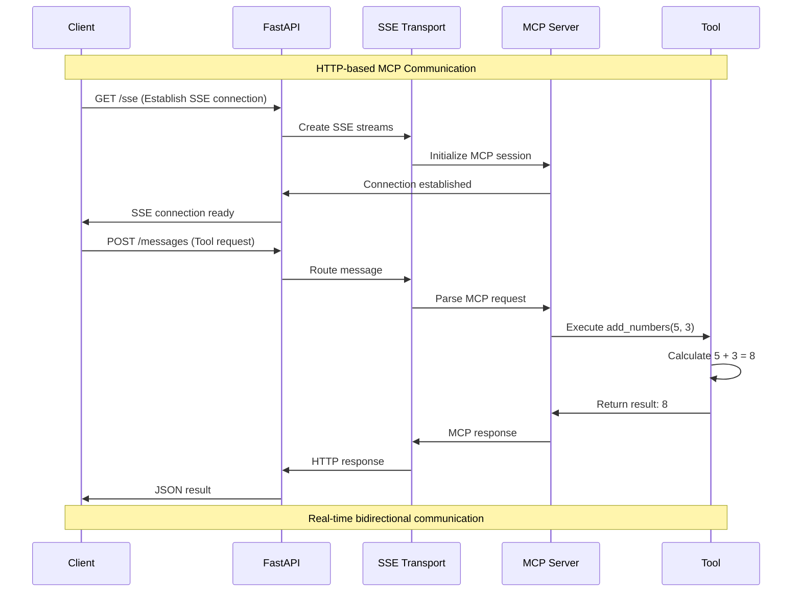
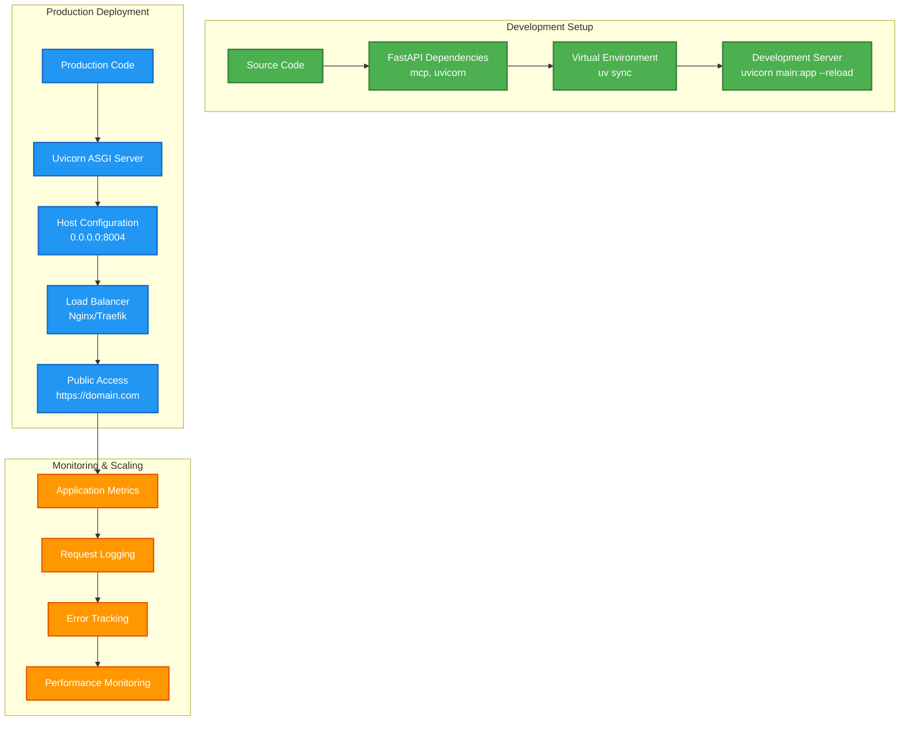
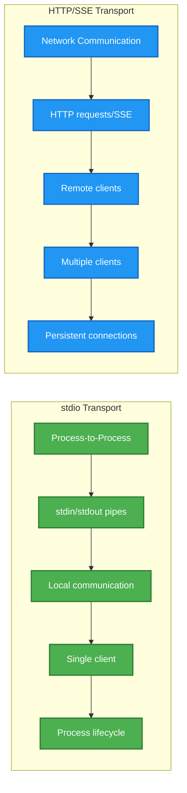

# 🌐 SSE MCP Server Architecture

## Overview
The SSE (Server-Sent Events) MCP Server demonstrates HTTP-based MCP communication using FastAPI and Server-Sent Events transport layer.

---

## 🏗️ SSE Server Architecture

```mermaid
graph TB
    subgraph "SSE MCP Server Stack"
        direction TB
        A[FastAPI Application] --> B[SSE Transport Layer]
        B --> C[FastMCP Server<br/>Demo]
        C --> D[Tool Registry]
        
        D --> E[add_numbers Tool]
        E --> F[Simple Addition Logic<br/>a + b]
    end
    
    subgraph "HTTP Endpoints"
        G[/sse] --> H[SSE Connection Endpoint]
        I[/messages] --> J[POST Message Handler]
    end
    
    subgraph "Transport Layer"
        K[SseServerTransport] --> L[HTTP to MCP Bridge]
        L --> M[Message Serialization]
        M --> N[Real-time Communication]
    end
    
    A --> G
    A --> I
    B --> K
    
    classDef fastapi fill:#4CAF50,stroke:#2E7D32,stroke-width:3px,color:#fff
    classDef sse fill:#2196F3,stroke:#1565C0,stroke-width:2px,color:#fff
    classDef tool fill:#FF9800,stroke:#E65100,stroke-width:2px,color:#fff
    classDef transport fill:#9C27B0,stroke:#6A1B9A,stroke-width:2px,color:#fff
    
    class A,G,I fastapi
    class B,H,J sse
    class C,D,E,F tool
    class K,L,M,N transport
```

---

## 🔄 SSE Communication Flow



---

## 🌐 HTTP Endpoint Structure

```mermaid
graph LR
    subgraph "FastAPI Routes"
        A[Main App] --> B[/sse Endpoint]
        A --> C[/messages Mount]
        A --> D[Uvicorn Server]
    end
    
    subgraph "SSE Endpoint Details"
        B --> E[GET Request Handler]
        E --> F[SSE Stream Creation]
        F --> G[MCP Server Initialization]
        G --> H[Real-time Connection]
    end
    
    subgraph "Messages Endpoint"
        C --> I[POST Message Handler]
        I --> J[MCP Request Processing] 
        J --> K[Tool Execution]
        K --> L[JSON Response]
    end
    
    classDef app fill:#4CAF50,stroke:#2E7D32,stroke-width:3px,color:#fff
    classDef sse fill:#2196F3,stroke:#1565C0,stroke-width:2px,color:#fff
    classDef messages fill:#FF9800,stroke:#E65100,stroke-width:2px,color:#fff
    
    class A,D app
    class B,E,F,G,H sse
    class C,I,J,K,L messages
```

---

## 🔧 FastAPI + MCP Integration

```mermaid
graph TD
    subgraph "Application Layer"
        A[FastAPI App Instance] --> B[Route Registration]
        B --> C[Middleware Setup]
        C --> D[CORS Configuration]
    end
    
    subgraph "MCP Integration"
        E[FastMCP Server] --> F[Tool Decorator<br/>@mcp_server.tool()]
        F --> G[add_numbers Function]
        G --> H[Type-safe Parameters<br/>a: int, b: int]
        H --> I[Return Type<br/>int result]
    end
    
    subgraph "Transport Bridge"
        J[SseServerTransport] --> K[/messages Route Mount]
        K --> L[HTTP to MCP Translation]
        L --> M[Async Request Handling]
    end
    
    A --> E
    E --> J
    
    classDef app fill:#4CAF50,stroke:#2E7D32,stroke-width:2px,color:#fff
    classDef mcp fill:#2196F3,stroke:#1565C0,stroke-width:2px,color:#fff
    classDef transport fill:#FF9800,stroke:#E65100,stroke-width:2px,color:#fff
    
    class A,B,C,D app
    class E,F,G,H,I mcp
    class J,K,L,M transport
```

---

## 🚀 Server Startup Process

```mermaid
graph LR
    A[main() Function] --> B[FastMCP Server Creation<br/>name: Demo]
    B --> C[Tool Registration<br/>add_numbers]
    C --> D[SSE Transport Setup<br/>/messages/ path]
    D --> E[Route Mounting<br/>FastAPI app]
    E --> F[SSE Endpoint Definition<br/>/sse handler]
    F --> G[Uvicorn Server Start<br/>host: 0.0.0.0, port: 8004]
    
    classDef startup fill:#4CAF50,stroke:#2E7D32,stroke-width:3px,color:#fff
    classDef config fill:#2196F3,stroke:#1565C0,stroke-width:2px,color:#fff
    classDef server fill:#FF9800,stroke:#E65100,stroke-width:2px,color:#fff
    
    class A,B,C startup
    class D,E,F config
    class G server
```

---

## 🔗 Client Connection Types

```mermaid
graph TB
    subgraph "Connection Methods"
        A[HTTP Client] --> B[Direct API Calls]
        C[WebSocket Client] --> D[Real-time Connection]
        E[SSE Client] --> F[Server-Sent Events]
        G[MCP Client] --> H[MCP Protocol Over HTTP]
    end
    
    subgraph "Server Endpoints"
        I[/sse] --> J[SSE Stream]
        K[/messages] --> L[HTTP POST]
        M[WebSocket Support] --> N[Bidirectional]
    end
    
    B --> K
    D --> M
    F --> I
    H --> I
    H --> K
    
    classDef client fill:#4CAF50,stroke:#2E7D32,stroke-width:2px,color:#fff
    classDef endpoint fill:#2196F3,stroke:#1565C0,stroke-width:2px,color:#fff
    classDef connection fill:#FF9800,stroke:#E65100,stroke-width:2px,color:#fff
    
    class A,C,E,G client
    class I,K,M endpoint
    class B,D,F,H,J,L,N connection
```

---

## 🛠️ Development & Deployment



---

## 📋 Quick Commands

### Development
```bash
# Install dependencies
uv sync

# Run development server
uv run python main.py

# Run with hot reload
uvicorn main:app --reload --host 0.0.0.0 --port 8004
```

### Testing SSE Connection
```bash
# Test SSE endpoint
curl -N http://localhost:8004/sse

# Test tool via HTTP POST
curl -X POST http://localhost:8004/messages \
  -H "Content-Type: application/json" \
  -d '{"method": "tools/call", "params": {"name": "add_numbers", "arguments": {"a": 5, "b": 3}}}'
```

### MCP Client Connection
```bash
# Connect MCP client to SSE server
cd ../mcp_client
uv run python client.py http://localhost:8004/sse
```

---

## 🌍 HTTP vs stdio Transport Comparison



---

## 🎯 Key Features

- 🌐 **HTTP-based MCP**: Web-friendly MCP server implementation
- ⚡ **FastAPI Framework**: High-performance async web framework
- 🔄 **Server-Sent Events**: Real-time bidirectional communication
- 🛠️ **FastMCP Integration**: Simplified MCP server creation
- 🌍 **Network Accessible**: Remote client connections
- 📡 **Multiple Transports**: SSE, WebSocket, and HTTP POST support
- 🔧 **Development Friendly**: Hot reload and easy debugging
- 📊 **Scalable Architecture**: Production-ready deployment options
- 🔒 **Type Safety**: TypeScript-style parameter validation
- 🚀 **Auto Documentation**: FastAPI's automatic API docs

---

## 🔧 Advanced Configuration

```python
# Custom SSE server with authentication
app = FastAPI()
mcp_server = FastMCP("AuthenticatedDemo")

@app.middleware("http")
async def auth_middleware(request: Request, call_next):
    # Add authentication logic
    token = request.headers.get("Authorization")
    if not validate_token(token):
        return JSONResponse({"error": "Unauthorized"}, status_code=401)
    return await call_next(request)

# Production deployment with SSL
uvicorn.run(app, host="0.0.0.0", port=443, ssl_keyfile="key.pem", ssl_certfile="cert.pem")
```

---

## 🎯 Use Cases

- 🌐 **Web Applications**: Browser-based MCP client integration
- 🔗 **API Services**: RESTful MCP tool access
- 📱 **Mobile Apps**: HTTP-based MCP client connectivity
- 🖥️ **Dashboard Applications**: Real-time data streaming
- 🔌 **Microservices**: MCP as a service architecture
- 🌍 **Remote Tools**: Network-accessible tool execution

---

*SSE MCP Server - Bringing MCP to the web with real-time communication! 🌐*
