# 🎯 Ultra Minimal MCP Server - Practical Examples

## Overview
This document provides educational examples for the Ultra Minimal MCP Server, demonstrating basic MCP concepts and simple tool usage patterns for learning purposes.

---

## 📚 Learning MCP Fundamentals

### Example 1: First MCP Tool Call
```
I'm new to MCP (Model Context Protocol) and want to test a simple tool.
Can you call the 'greet' function with my name "Alice"?

This should demonstrate the basic MCP tool calling mechanism.
```

**Expected MCP Tool Call:**
```json
{
  "method": "tools/call",
  "params": {
    "name": "greet",
    "arguments": {
      "name": "Alice"
    }
  }
}
```

**Response:**
```json
{
  "content": [
    {
      "type": "text",
      "text": "Hello, Alice! Welcome to the Ultra Minimal MCP Server."
    }
  ]
}
```

**Learning Points:**
- Tool name must match exactly: `greet`
- Arguments passed as JSON object
- Simple string parameter handling
- Basic response structure

---

### Example 2: Understanding Tool Discovery
```
Show me what tools are available in this minimal MCP server.
I want to understand how MCP servers expose their capabilities.
```

**MCP Tools List Response:**


**Tool Schema:**
```json
{
  "name": "greet",
  "description": "A simple greeting tool that takes a name and returns a personalized greeting",
  "inputSchema": {
    "type": "object",
    "properties": {
      "name": {
        "type": "string",
        "description": "The name of the person to greet"
      }
    },
    "required": ["name"]
  }
}
```

---

## 🎓 Educational Use Cases

### Example 3: MCP Protocol Flow
```
Walk me through what happens when I call the greet function step by step.
I want to understand the complete MCP request/response cycle.
```

**MCP Protocol Flow:**


**Step-by-Step Breakdown:**
1. **Tool Discovery**: Client requests available tools
2. **Tool Selection**: Client chooses `greet` tool
3. **Parameter Validation**: Server validates `name` parameter
4. **Tool Execution**: Server runs greeting logic
5. **Response Formation**: Server formats response
6. **Result Return**: Client receives formatted greeting

---

### Example 4: Testing Different Inputs
```
Test the greet function with various inputs to understand parameter handling:
- Normal name: "John"
- Name with spaces: "Mary Jane"  
- Empty string: ""
- Special characters: "José"

Show how the MCP server handles different input types.
```

**Input Validation Testing:**

```mermaid
graph TD
    A[Input Testing] --> B[Valid Inputs]
    A --> C[Edge Cases]
    A --> D[Error Handling]
    
    B --> E["John" → Valid]
    B --> F["Mary Jane" → Valid]
    B --> G["José" → Valid]
    
    C --> H["" → Empty string]
    C --> I["   " → Whitespace only]
    C --> J["123" → Numbers]
    
    D --> K[Missing parameter]
    D --> L[Wrong parameter type]
    D --> M[Extra parameters]
    
    classDef valid fill:#4CAF50,stroke:#2E7D32,stroke-width:2px,color:#fff
    classDef edge fill:#FF9800,stroke:#E65100,stroke-width:2px,color:#fff
    classDef error fill:#f44336,stroke:#c62828,stroke-width:2px,color:#fff
    
    class A,B,E,F,G valid
    class C,H,I,J edge
    class D,K,L,M error
```


**Test Calls:**
1. `greet("John")` → "Hello, John! Welcome to the Ultra Minimal MCP Server."
2. `greet("Mary Jane")` → "Hello, Mary Jane! Welcome to the Ultra Minimal MCP Server."
3. `greet("")` → "Hello, ! Welcome to the Ultra Minimal MCP Server."
4. `greet("José")` → "Hello, José! Welcome to the Ultra Minimal MCP Server."

---

## 🛠️ Development Learning

### Example 5: MCP Server Architecture
```
Explain how this minimal server is structured and what makes it a good learning example.
Show the code architecture and how it implements the MCP standard.
```

**Server Architecture:**


**Key Components:**
- **FastMCP**: Simplified MCP server framework
- **Tool Registration**: Single `greet` function
- **Parameter Validation**: Type checking for `name`
- **Response Handling**: Structured text response
- **Error Management**: Basic error handling

---

### Example 6: Building on the Minimal Example
```
I understand the basic greet function. How would I extend this server to add more tools?
Show me the pattern for adding additional functionality.
```

**Extension Patterns:**


**Hypothetical Extensions:**
```python
# Following the same pattern as greet
@app.tool()
def farewell(name: str) -> str:
    """Say goodbye to someone"""
    return f"Goodbye, {name}! Thanks for using the MCP server."

@app.tool()
def count_words(text: str) -> str:
    """Count words in a text string"""
    word_count = len(text.split())
    return f"The text contains {word_count} words."
```

---

## 🧪 Testing & Debugging

### Example 7: MCP Client Testing
```
How do I test this minimal server? Show me how to connect a client and verify the tool works correctly.
```

**Testing Setup:**


**Testing Commands:**
```bash
# Terminal 1: Start the server
cd /Users/elsayed/side-projects/sessions/stdio_mcp_server
uv run python ultra_minimal_server.py

# Terminal 2: Connect client and test
cd ../mcp_client
uv run python client.py ../stdio_mcp_server/ultra_minimal_server.py

# Interactive testing:
> list_tools
> greet Alice
> greet "John Doe"
> greet ""
```

---

### Example 8: Error Handling Demonstration
```
Show me what happens when I make invalid requests to the minimal server.
This will help me understand MCP error handling.
```

**Error Scenarios:**


**Error Examples:**
1. **Missing Parameter**: `greet()` without name
2. **Wrong Type**: `greet(123)` number instead of string  
3. **Unknown Tool**: `unknown_tool("test")`
4. **Extra Parameters**: `greet("Alice", "extra")`

---

## 🎯 MCP Concepts Demonstrated

### Example 9: Protocol Standards
```
What MCP protocol standards does this minimal server demonstrate?
Help me understand the core MCP concepts through this simple example.
```

**MCP Standards Shown:**


**Core Concepts:**
- **Transport**: STDIO-based communication
- **Discovery**: `tools/list` for capability exposure
- **Execution**: `tools/call` for function invocation
- **Schemas**: JSON Schema for parameter validation
- **Responses**: Structured result formatting

---

### Example 10: Learning Path
```
I've mastered this minimal server. What should I learn next in the MCP ecosystem?
Guide me through the progression from this simple example to more complex servers.
```

**MCP Learning Progression:**


**Next Steps:**
1. **Calculator Server**: Learn multiple tools and data types
2. **Image Generator**: Understand external API integration
3. **Dev Blog Server**: Master complex workflows and authentication
4. **SSE Server**: Explore HTTP-based MCP transport
5. **Custom Server**: Build your own MCP server from scratch

---

## 🔧 Ultra Minimal Server Features


---

## 🚀 Quick Start Guide

```bash
# Clone and setup the project
git clone <repository>
cd stdio_mcp_server

# Install dependencies
uv sync

# Start the ultra minimal server
uv run python ultra_minimal_server.py

# In another terminal, connect the client
cd ../mcp_client
uv run python client.py ../stdio_mcp_server/ultra_minimal_server.py

# Try these commands:
> list_tools                    # See available tools
> greet "World"                 # Test the greet function
> greet "Your Name"             # Personalized greeting
> help                          # Client help
> quit                          # Exit the client
```

---

## 💡 Educational Tips

### For Beginners:
- **Start Here**: Perfect first MCP server to understand
- **Simple Code**: Easy to read and modify
- **Clear Purpose**: One tool, one function, clear result
- **Foundation**: Building block for more complex servers

### For Educators:
- **Teaching Tool**: Demonstrate MCP concepts clearly
- **Extensible**: Easy to add new tools for exercises
- **Debuggable**: Simple enough to step through code
- **Standards**: Shows proper MCP implementation

### For Developers:
- **Template**: Starting point for new MCP servers
- **Reference**: Minimal working example
- **Testing**: Validate MCP client implementations
- **Prototype**: Quick server for testing ideas

---

*Ultra Minimal MCP Server - Your gateway to understanding MCP! 🎯*
