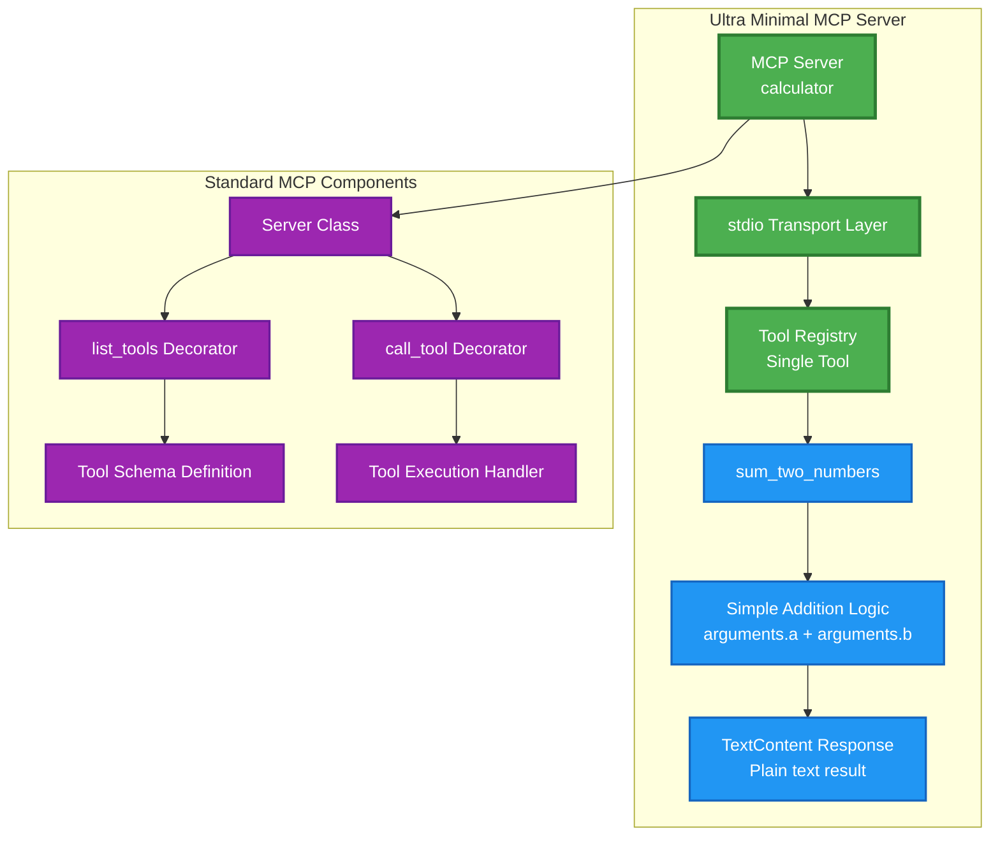
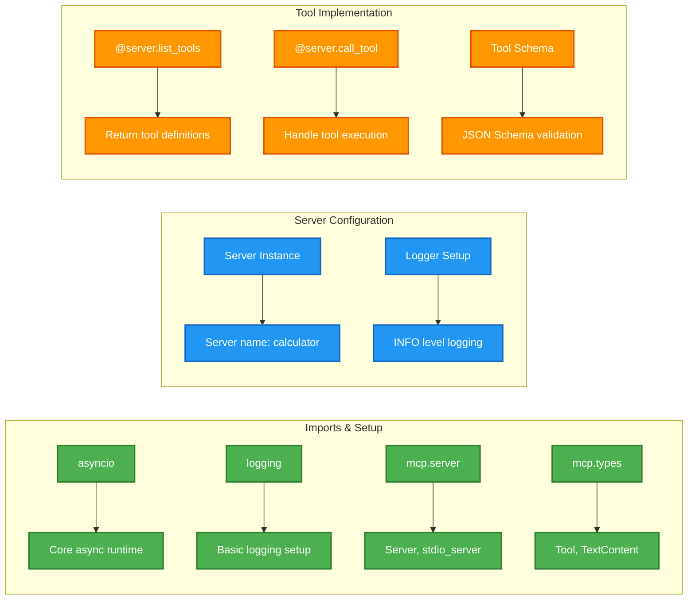
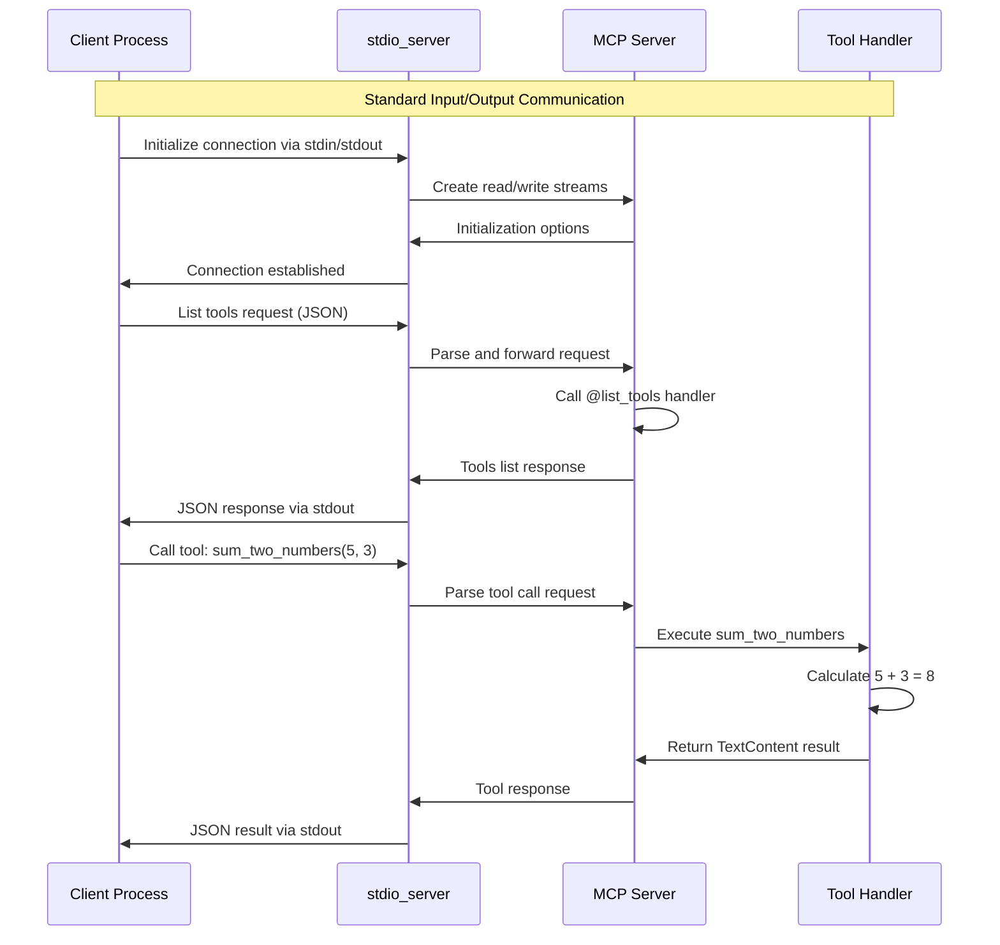
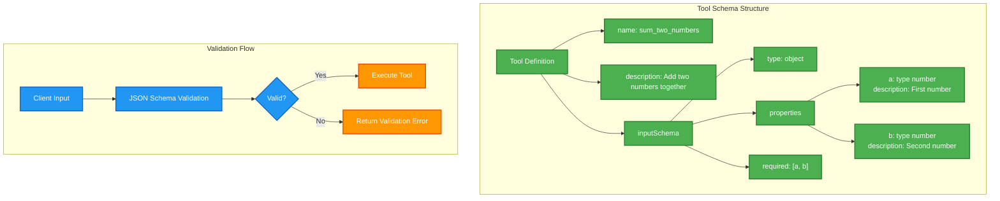
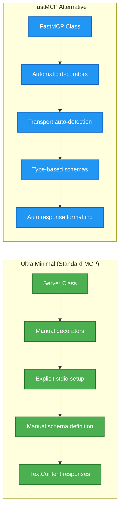

# ⚡ Ultra Minimal MCP Server Architecture

## Overview
The Ultra Minimal MCP Server is the simplest possible MCP implementation, providing a basic calculator function using standard MCP library with stdio transport.

---

## 🏗️ Minimal Server Architecture



---

## 🔧 Code Structure Breakdown



---

## 🔄 Stdio Transport Communication



---

## 📋 Tool Schema Definition




---

## 📋 Quick Commands

### Direct Execution
```bash
# Run the server directly
uv run python ultra_minimal_server.py

# With explicit python version
python3 ultra_minimal_server.py

# With virtual environment
source .venv/bin/activate && python ultra_minimal_server.py
```

### Testing with MCP Client
```bash
# Using the included client
cd ../mcp_client
uv run python client.py ../stdio_mcp_server/ultra_minimal_server.py
```

### Tool Usage Example
```json
{
  "method": "tools/call",
  "params": {
    "name": "sum_two_numbers",
    "arguments": {
      "a": 15,
      "b": 27
    }
  }
}

// Response:
{
  "result": [
    {
      "type": "text", 
      "text": "The sum of 15 and 27 is 42 (Calculated by MCP server)."
    }
  ]
}
```

---

## 🔍 Code Comparison: Minimal vs FastMCP



---

## 🎯 Key Features

- 🎯 **Absolute Simplicity**: Minimal code, maximum clarity
- 📚 **Educational Focus**: Perfect for learning MCP concepts
- 🔧 **Standard Library**: Uses core MCP without abstractions
- 📡 **stdio Transport**: Standard input/output communication
- ✅ **Schema Validation**: Proper input validation with JSON Schema
- 🛡️ **Error Handling**: Basic error handling for unknown tools
- 📝 **Clear Logging**: Informative logging for debugging
- 🚀 **Async Ready**: Fully asynchronous implementation
- 🔒 **Type Safety**: Proper type hints and validation
- 📦 **Zero Dependencies**: Only uses core MCP library

---

## 💡 Learning Objectives

This minimal server teaches:
- Basic MCP server structure
- Tool registration patterns
- Schema definition requirements
- stdio transport usage
- Async/await patterns
- Error handling basics
- Logging best practices

---

*Ultra Minimal MCP Server - The perfect starting point for MCP development! ⚡*
