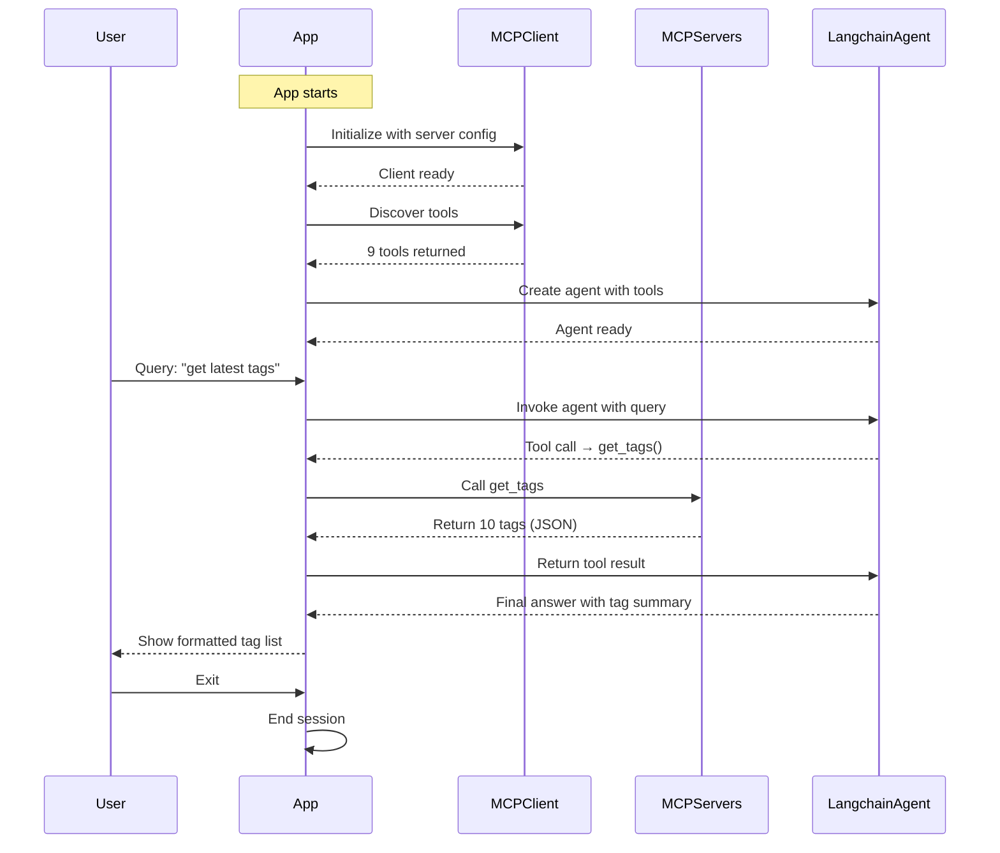

```mermaid
sequenceDiagram
    participant User
    participant App
    participant MCPClient
    participant MCPServers
    participant LangchainAgent

    Note over App: App starts
    App->>MCPClient: Initialize with server config
    MCPClient-->>App: Client ready

    App->>MCPClient: Discover tools
    MCPClient-->>App: 9 tools returned

    App->>LangchainAgent: Create agent with tools
    LangchainAgent-->>App: Agent ready

    User->>App: Query: "get latest tags"
    App->>LangchainAgent: Invoke agent with query
    LangchainAgent-->>App: Tool call → get_tags()

    App->>MCPServers: Call get_tags
    MCPServers-->>App: Return 10 tags (JSON)

    App->>LangchainAgent: Return tool result
    LangchainAgent-->>App: Final answer with tag summary
    App-->>User: Show formatted tag list

    User->>App: Exit
    App->>App: End session
```